# LinkSauce API开放平台开发文档

## 一、项目脚手架搭建

### 1、Ant Design Pro

> 查看 [官方文档](pro.ant.design/zh-CN/docs/getting-started)

1. 安装初始化脚手架

   ```shell
   # 使用 npm
   npm i @ant-design/pro-cli -g
   ```

2. 打开将要存放项目的文件夹 创建项目

   ```shell
   pro create linksauce-frontend
   ```

   **选择umi版本**

   >   ```shell
   >   ? 🐂 使用 umi@4 还是 umi@3 ? (Use arrow keys)
   >   ❯ umi@4
   >    umi@3
   >   ```

3. 安装yarn

   ```shell
   # 全局安装
   npm install -g yarn
   ```

   查看yarn版本

   ```shell
   yarn -version
   ```

4. 安装依赖

   ```shell
   yarn
   ```

5. 运行测试`package.json`中的`start`

   

   

6. 项目瘦身，**有坑，可跳过！！！**

   - 运行`package.json`中的`i18n-remove`去除国际化，手动删除`src\locales`

     > 如果报错，检查一下是不是没删干净，可以手动去除

     **AntDesign去国际化 后 router页面显示问题：**

     >   解决方法：执行 
     >
     >   yarn add eslint-config-prettier
     >
     >   yarn add eslint-plugin-unicorn
     >
     >   然后修改node_modules/@umijs/lint/dist/config/eslint/index.js 
     >
     >   // es2022: true把这个注释掉就可以解决问题

     如果不行，修改`config\routes.ts`如下即可：

     ```ts
     export default [
       { name: '登录', path: '/user', layout: false, routes: [{ path: '/user/login', component: './User/Login' }] },
       { name: '欢迎页面', path: '/welcome', icon: 'smile', component: './Welcome' },
       {
         path: '/admin',
         icon: 'crown',
         access: 'canAdmin',
         name: '管理员页面',
         routes: [
           { path: '/admin', redirect: '/admin/sub-page' },
           { path: '/admin/sub-page', component: './Admin' },
         ],
       },
       { icon: 'table', path: '/list', component: './TableList', name: '表格页' },
       { path: '/', redirect: '/welcome' },
       { path: '*', layout: false, component: './404' },
     ];
     ```

   - 删除`src\tests`

7. 重新安装依赖，重复第五步，确认是否能正常运行

   ```shell
   yarn
   ```


### 2、后端

#### 2.1. 初始化

> 参考使用[springboot-init模板](https://github.com/zhOhh/sptingboot-init)

#### 2.2. 数据库表设计

**基本结构**

| 字段名         | 备注                         |
| -------------- | ---------------------------- |
| id             | 用户id                       |
| name           | 名称                         |
| description    | 描述                         |
| url            | 接口地址                     |
| request_header | 请求头                       |
| reponse_header | 响应头                       |
| status         | 接口状态（0-关闭 1-开启）    |
| method         | 请求类型                     |
| user_id        | 创建人                       |
| create_time    | 创建时间                     |
| update_time    | 更新时间                     |
| is_delete      | 逻辑删除 （0-未删 ，1-已删） |

**代码**

> 可以用鱼皮写的sql生成工具生成一下代码   [SQL之父](https://www.sqlfather.com/)

填对应的数据，一键生成即可

```sql
use linksauce;

-- 接口信息
create table if not exists linksauce.`interface_info`
(
    `id` bigint not null auto_increment comment '主键' primary key,
    `name` varchar(256) not null comment '名称',
    `description` varchar(256) null comment '描述',
    `url` varchar(512) not null comment '接口地址',
    `requestHeader` text null comment '请求头',
    `responseHeader` text null comment '响应头',
    `status` int default 0 not null comment '接口状态（0-关闭，1-开启）',
    `method` varchar(256) not null comment '请求类型',
    `userId` bigint not null comment '创建人',
    `createTime` datetime default CURRENT_TIMESTAMP not null comment '创建时间',
    `updateTime` datetime default CURRENT_TIMESTAMP not null on update CURRENT_TIMESTAMP comment '更新时间',
    `isDelete` tinyint default 0 not null comment '是否删除(0-未删, 1-已删)'
) comment '接口信息';

insert into linksauce.`interface_info` (`name`, `description`, `url`, `requestHeader`, `responseHeader`, `status`, `method`, `userId`) values ('廖立轩', '脱颖而出', 'www.foster-larkin.co', '龙嘉懿', '秦天磊', 0, 'GET', 1718083101);
insert into linksauce.`interface_info` (`name`, `description`, `url`, `requestHeader`, `responseHeader`, `status`, `method`, `userId`) values ('曹明辉', '举一反三', 'www.tony-kiehn.com', '任擎苍', '陈凯瑞', 0, 'GET', 28978);
insert into linksauce.`interface_info` (`name`, `description`, `url`, `requestHeader`, `responseHeader`, `status`, `method`, `userId`) values ('金乐驹', '首当其冲', 'www.coleen-prosacco.net', '毛浩', '陆致远', 0, 'GET', 208);
insert into linksauce.`interface_info` (`name`, `description`, `url`, `requestHeader`, `responseHeader`, `status`, `method`, `userId`) values ('廖思', '来之不易', 'www.don-sipes.net', '梁彬', '白君浩', 0, 'GET', 470);
insert into linksauce.`interface_info` (`name`, `description`, `url`, `requestHeader`, `responseHeader`, `status`, `method`, `userId`) values ('董煜祺', '长治久安', 'www.terry-turner.co', '覃绍齐', '胡雪松', 0, 'GET', 611007);
insert into linksauce.`interface_info` (`name`, `description`, `url`, `requestHeader`, `responseHeader`, `status`, `method`, `userId`) values ('侯聪健', '精心设计', 'www.augustus-yost.info', '傅鸿煊', '潘鹏飞', 0, 'GET', 0);
insert into linksauce.`interface_info` (`name`, `description`, `url`, `requestHeader`, `responseHeader`, `status`, `method`, `userId`) values ('魏弘文', '玩忽职守', 'www.guadalupe-beatty.biz', '江梓晨', '魏思淼', 0, 'GET', 1162536022);
insert into linksauce.`interface_info` (`name`, `description`, `url`, `requestHeader`, `responseHeader`, `status`, `method`, `userId`) values ('于苑博', '各式各样', 'www.nolan-metz.net', '韦果', '金胤祥', 0, 'GET', 0);
insert into linksauce.`interface_info` (`name`, `description`, `url`, `requestHeader`, `responseHeader`, `status`, `method`, `userId`) values ('姚炫明', '翻天覆地', 'www.jodie-schultz.info', '许越彬', '毛晋鹏', 0, 'GET', 973);
insert into linksauce.`interface_info` (`name`, `description`, `url`, `requestHeader`, `responseHeader`, `status`, `method`, `userId`) values ('孙鑫鹏', '络绎不绝', 'www.liza-sporer.co', '孙彬', '傅鸿煊', 0, 'GET', 30308);
insert into linksauce.`interface_info` (`name`, `description`, `url`, `requestHeader`, `responseHeader`, `status`, `method`, `userId`) values ('唐展鹏', '铤而走险', 'www.hayden-purdy.co', '杨哲瀚', '陆凯瑞', 0, 'GET', 473462835);
insert into linksauce.`interface_info` (`name`, `description`, `url`, `requestHeader`, `responseHeader`, `status`, `method`, `userId`) values ('曹擎苍', '赞不绝口', 'www.phung-glover.org', '邱志泽', '张健雄', 0, 'GET', 32155653);
insert into linksauce.`interface_info` (`name`, `description`, `url`, `requestHeader`, `responseHeader`, `status`, `method`, `userId`) values ('夏烨霖', '哭笑不得', 'www.augustine-funk.org', '宋聪健', '郝鹏涛', 0, 'GET', 3964);
insert into linksauce.`interface_info` (`name`, `description`, `url`, `requestHeader`, `responseHeader`, `status`, `method`, `userId`) values ('董浩', '对症下药', 'www.erik-hamill.biz', '黎立果', '廖鹤轩', 0, 'GET', 2275);
insert into linksauce.`interface_info` (`name`, `description`, `url`, `requestHeader`, `responseHeader`, `status`, `method`, `userId`) values ('罗荣轩', '喜闻乐见', 'www.gia-hermann.biz', '韩煜城', '阎耀杰', 0, 'GET', 847);
insert into linksauce.`interface_info` (`name`, `description`, `url`, `requestHeader`, `responseHeader`, `status`, `method`, `userId`) values ('沈正豪', '统筹兼顾', 'www.isabella-reinger.io', '邓子轩', '廖伟诚', 0, 'GET', 997378602);
insert into linksauce.`interface_info` (`name`, `description`, `url`, `requestHeader`, `responseHeader`, `status`, `method`, `userId`) values ('任立果', '出人意料', 'www.geoffrey-koss.name', '覃浩然', '萧雨泽', 0, 'GET', 403);
insert into linksauce.`interface_info` (`name`, `description`, `url`, `requestHeader`, `responseHeader`, `status`, `method`, `userId`) values ('张炫明', '名不虚传', 'www.ellan-gleason.com', '黎正豪', '韦炎彬', 0, 'GET', 35127293);
insert into linksauce.`interface_info` (`name`, `description`, `url`, `requestHeader`, `responseHeader`, `status`, `method`, `userId`) values ('方雨泽', '衣食住行', 'www.wilton-walsh.biz', '黎越泽', '白远航', 0, 'GET', 62264);
insert into linksauce.`interface_info` (`name`, `description`, `url`, `requestHeader`, `responseHeader`, `status`, `method`, `userId`) values ('袁天翊', '卷土重来', 'www.lynetta-mclaughlin.info', '邹熠彤', '叶潇然', 0, 'GET', 9884455);
```

#### 2.3. MabatisX插件

生成domain、mapper、service

打开新建的表，右击选择MybatisX-Generator

勾上驼峰


根据**版本和需要打勾**，点击完成


#### 2.4. Controller

> 我们只需要将**PostController**复制一份改名为**InterfaceInfoController**即可,因为逻辑是差不多，都是进行增删改查

然后将post改成interfaceInfo、Post改成InterfaceInfo

根据报错信息我们来补充信息


#### 2.5. Model

##### (1) Entity

```java
package com.ohh.project.model.entity;

import com.baomidou.mybatisplus.annotation.*;

import java.io.Serializable;
import java.util.Date;
import lombok.Data;

/**
 * 接口信息
 * @TableName interface_info
 */
@TableName(value ="interface_info")
@Data
public class InterfaceInfo implements Serializable {
    /**
     * 主键
     */
    @TableId(type = IdType.AUTO)
    private Long id;

    /**
     * 名称
     */
    private String name;

    /**
     * 描述
     */
    private String description;

    /**
     * 接口地址
     */
    private String url;

    /**
     * 请求头
     */
    private String requestHeader;

    /**
     * 响应头
     */
    private String responseHeader;

    /**
     * 接口状态（0-关闭，1-开启）
     */
    private Integer status;

    /**
     * 请求类型
     */
    private String method;

    /**
     * 创建人
     */
    private Long userId;

    /**
     * 创建时间
     */
    private Date createTime;

    /**
     * 更新时间
     */
    private Date updateTime;

    /**
     * 是否删除(0-未删, 1-已删)
     */
    @TableLogic
    private Integer isDelete;

    @TableField(exist = false)
    private static final long serialVersionUID = 1L;
}
```

##### (2) DTO

首先先增加DTO，在InterfaceInfo类从拿我们需要的信息做成三个DTO类（分别是新增、查询、更新）删除的请求我们封装在common包下


#### 2.6. Service

根据报错可知 service层缺少一个方法validInterfaceInfo

```java
package com.ohh.project.service.impl;

import com.baomidou.mybatisplus.extension.service.impl.ServiceImpl;
import com.ohh.project.common.ErrorCode;
import com.ohh.project.exception.BusinessException;
import com.ohh.project.mapper.InterfaceInfoMapper;
import com.ohh.project.model.entity.InterfaceInfo;
import com.ohh.project.service.InterfaceInfoService;
import org.apache.commons.lang3.ObjectUtils;
import org.apache.commons.lang3.StringUtils;
import org.springframework.stereotype.Service;

/**
* @author 12994
* @description 针对表【interface_info(接口信息)】的数据库操作Service实现
* @createDate 2024-03-29 18:05:35
*/
@Service
public class InterfaceInfoServiceImpl extends ServiceImpl<InterfaceInfoMapper, InterfaceInfo>
    implements InterfaceInfoService {

    @Override
    public void validInterfaceInfo(InterfaceInfo interfaceInfo, boolean add) {
        if (interfaceInfo == null) {
            throw new BusinessException(ErrorCode.PARAMS_ERROR);
        }

        String name = interfaceInfo.getName();
        String description = interfaceInfo.getDescription();
        String url = interfaceInfo.getUrl();
        String requestHeader = interfaceInfo.getRequestHeader();
        String responseHeader = interfaceInfo.getResponseHeader();
        Integer status = interfaceInfo.getStatus();
        String method = interfaceInfo.getMethod();
        Long userId = interfaceInfo.getUserId();

        // 创建时，所有参数必须非空
        if (add) {
            if (StringUtils.isAnyBlank(name, description, url, requestHeader, responseHeader, method) || ObjectUtils.anyNull(userId, status)) {
                throw new BusinessException(ErrorCode.PARAMS_ERROR);
            }
        }
        if (StringUtils.isNotBlank(name) && name.length() > 256) {
            throw new BusinessException(ErrorCode.PARAMS_ERROR, "名字过长");
        }
        if (StringUtils.isNotBlank(description) && description.length() > 512) {
            throw new BusinessException(ErrorCode.PARAMS_ERROR, "描述过长");
        }
    }

}

```

### 3、前端

#### 3.1. 配置插件

为了项目更加规范

> 搜索 **eslint** 选上自动识别


> 搜索**prettier** 打√  美化代码


#### 3.2. 接口调用

使用 **oneapi** 插件自动生成

如果要前端自动生成，需要将后端的遵循**openapi**规范的**json**文档 

> 后端的遵循**openapi**规范的**json**文档 

找到我们起的后端主页

找到我们起的后端主页


在地址栏输入http://localhost:7529/api/v3/api-docs

发现如下所示


那么我们就可以使用这个url了

**修改：**`config\config.ts` ，找到**openApi** 修改如下

```tsx
openAPI: [
    {
      requestLibPath: "import { request } from '@umijs/max'",
      schemaPath: 'http://localhost:7529/api/v3/api-docs',
      projectName: 'linksauce-backend',
    },
  ],
```

测试一下是否能用

> 找到**package.json**,执行**openapi**命令
>
> 

执行成功，查看**service**文件夹


由于我们有后端 ，应请求真实环境，所以直接用**dev模式**运行

```bash
npm run start:dev
```

可以将项目中的`requestErrorConfig.ts`改为`requestConfig.ts`

然后在`app.tsx` 找到 request配置，将其修改成我们改的

```java
export const request = {
  ...requestConfig,
};
```

**找到`requestConfig.ts`**

修改名字，并设置一下后端地址

**设置cookie!!!**


> ```java
> baseURL: 'http://localhost:7529',
> withCredentials: true,
> ```

#### 3.3. 修改登录接口

找到`src/pages/User/Login/index.tsx`下的**handleSubmit**

修改用户名和密码的字段和后端保持一致

**设置用户登录态**

回到`app.tsx`找到**getInitialState()**这个方法

这个方法当首次访问页面的时候，获取用户的信息，获取当前全局的一些状态，可以把它当成全局变量

找到`typings.d.ts`

```ts
/**
 * 全局状态类型
 */
interface InitialState{
  loginUser?:API.UserVO;
}
```

返回**getInitialState()**将它改为

```tsx
export async function getInitialState(): Promise<InitialState> {
  // 当页面首次加载时，获取要全局保存的数据，如用户登录信息
  const state: InitialState = {
    loginUser: undefined,
  };
  try {
    const res = await getLoginUserUsingGet();
    if (res.data) {
      state.loginUser = res.data;
    }
  } catch (error) {
    history.push(loginPath);
  }
  return state;
}
```


返回`src/pages/User/Login/index.tsx`下的**handleSubmit**

设置登录状态

```tsx
  const handleSubmit = async (values: API.UserLoginRequest) => {
    try {
      // 登录
      const res = await userLoginUsingPOST({ ...values });
      if (res.data) {
        const urlParams = new URL(window.location.href).searchParams;
        history.push(urlParams.get('redirect') || '/');
        setInitialState({
          loginUser: res.data
        });
        return;
      }
    } catch (error) {
      const defaultLoginFailureMessage = intl.formatMessage({
        id: 'pages.login.failure',
        defaultMessage: '登录失败，请重试！',
      });
      console.log(error);
      message.error(defaultLoginFailureMessage);
    }
  };
```

#### 3.4. 注销

找到`src/components/RightContent/AvatarDropdown.tsx`的**loginout()**将其改为自己的后端方法

```java
const onMenuClick = useCallback(
  (event: MenuInfo) => {
    const { key } = event;
    if (key === 'logout') {
      flushSync(() => {
        setInitialState((s) => ({ ...s, currentUser: undefined }));
      });
      userLogoutUsingPost();
      return;
    }
    history.push(`/account/${key}`);
  },
  [setInitialState],
);
```

#### 3.5. 设置管理权限 

修改`access.ts`

```ts
/**
 * @see https://umijs.org/docs/max/access#access
 * */
export default function access(initialState: InitialState | undefined) {
  const { loginUser } = initialState ?? {};
  return {
    // canAdmin: currentUser && currentUser.access === 'admin',
    canUser: loginUser,
    canAdmin: loginUser?.userRole === 'admin',
  };
}
 
```

#### 3.6. 修改表格内容

找到`src/pages/TableList/index.tsx`的**columns**，修改如下

```tsx
const columns: ProColumns<API.InterfaceInfo>[] = [
  {
    title: 'id',
    dataIndex: 'id',
    valueType: 'index',
  },
  {
    title: '接口名称',
    dataIndex: 'name',
    valueType: 'text',
  },
  {
    title: '描述',
    dataIndex: 'description',
    valueType: 'textarea',
  },
  {
    title: '请求方法',
    dataIndex: 'method',
    valueType: 'textarea',
  },
  {
    title: 'url',
    dataIndex: 'url',
    valueType: 'text',
  },
  {
    title: '请求头',
    dataIndex: 'requestHeader',
    valueType: 'textarea',
  },
  {
    title: '响应头',
    dataIndex: 'responseHeader',
    valueType: 'textarea',
  },
  {
    title: '状态',
    dataIndex: 'status',
    hideInForm: true,
    valueEnum: {
      0: {
        text: '关闭',
        status: 'Default',
      },
      1: {
        text: '运行中',
        status: 'Processing',
      },
    },
  },
  {
    title: '创建时间',
    dataIndex: 'createTime',
    valueType: 'dateTime',
  },
  {
    title: '更新时间',
    dataIndex: 'updateTime',
    valueType: 'dateTime',
  },
  {
    title: '操作',
    dataIndex: 'option',
    valueType: 'option',
    render: (_, record) => [
      <a
        key="config"
        onClick={() => {
          handleUpdateModalOpen(true);
          setCurrentRow(record);
        }}
      >
        配置
      </a>,
      <a key="subscribeAlert" href="https://procomponents.ant.design/">
        订阅警报
      </a>,
    ],
  },
];
```

修改`request`如下：

```tsx
request={async (
  params: {
    pageSize?: number;
    current?: number;
    keyword?: string;
  }, sort: Record<string, SortOrder>,  filter: Record<string, React.ReactText[] | null>,) => {
  const res = await listInterfaceInfoByPageUsingGet({ ...params });
  if (res.data) {
    return {
      data: res.data.records || [],
      success: true,
      total: res.data.total,
    };
  } else {
    return {
      data: [],
      success: false,
      total: 0,
    };
  }
}}
```

**刷新页面，显示成功**


## 二、基础增删改查

### 1、修改路由

打开**config**包找到 **routes.ts**

将原来pages下的**TableList**表单名称改为我们的**interfaceInfo**，再把接口管理页面配置到管理员页面下

```js
{
  name: '接口管理',
  icon: 'table',
  path: '/admin/interface_info',
  component: './InterfaceInfo',
}
```


```typescript
export default [
  {
    path: '/user',
    layout: false,
    routes: [
      {
        name: 'login',
        path: '/user/login',
        component: './User/Login',
      },
    ],
  },
  {
    path: '/welcome',
    name: 'welcome',
    icon: 'smile',
    component: './Welcome',
  },
  {
    path: '/admin',
    name: 'admin',
    icon: 'crown',
    access: 'canAdmin',
    routes: [
      {
        path: '/admin',
        redirect: '/admin/sub-page',
      },
      {
        path: '/admin/sub-page',
        name: 'sub-page',
        component: './Admin',
      },
      {
        name: '接口管理',
        icon: 'table',
        path: '/admin/interface_info',
        component: './InterfaceInfo',
      },
    ],
  },
  {
    path: '/',
    redirect: '/welcome',
  },
  {
    path: '*',
    layout: false,
    component: './404',
  },
];

```

效果如下


### 2、新增接口信息

---

#### 2.1. 表单模块

**interfaceInfo**中的**index.tsx**找到新建的Button


我们点击新建的时候，他会打开一个模态框。往下找，发现它已经给我们提供了这个组件。但是我们需要重新写


我们可以就像更新模态框一样新建一个CreateModal.tsx


接下来修改从UpdateForm中粘贴的**CreateModal.tsx**的代码

```tsx
import { Modal } from 'antd';
import React from 'react';
import { ProColumns, ProTable } from '@ant-design/pro-components';
import '@umijs/max';

export type Props = {
  columns: ProColumns<API.InterfaceInfo>[];
  onCancel: () => void;
  onSubmit: (values: API.InterfaceInfo) => Promise<boolean>;
  open: boolean;
};

const CreateModal: React.FC<Props> = (props) => {
  const { columns, open, onCancel } = props;
  return (
    <Modal open={open} onCancel={() => onCancel?.()}>
      <ProTable columns={columns} />
    </Modal>
  );
};

export default CreateModal;
```

**这里我们复用了index中的columns**  这里我顺便把取消也写了

在**index.tsx**中使用

```tsx
  /**
   * @en-US Pop-up window of new window
   * @zh-CN 新建窗口的弹窗
   *  */
  const [createModalOpen, handleModalOpen] = useState<boolean>(false);
	
 	const columns: ProColumns<API.InterfaceInfo>[] = [
    {
      title: 'id',
      dataIndex: 'id',
      valueType: 'index',
    },
   // ...
  ]

	// ...
	<CreateModal
    columns={columns}
    onCancel={() => handleModalOpen(false)}
    onSubmit={() => {}}
    open={createModalOpen}
  />
```

测试一下


emmmm... 这是什么玩意??

查询官方文档可知，这是ProTable的默认type 所以我们需要给它指定一个form的type

```tsx
const CreateModal: React.FC<Props> = (props) => {
  const { columns, open, onCancel } = props;
  return (
    <Modal open={open} onCancel={() => onCancel?.()}>
      <ProTable columns={columns} type={'form'} />
    </Modal>
  );
};
```

再测试一下就正常啦~


发现创建时间、更新时间我们并不需要。增加hideInForm属性

```tsx
    {
      title: '创建时间',
      dataIndex: 'createTime',
      valueType: 'dateTime',
      hideInForm: true,
    },
    {
      title: '更新时间',
      dataIndex: 'updateTime',
      valueType: 'dateTime',
      hideInForm: true,
    },
```


#### 2.2. 请求后端

**先简单处理一下请求报错的情况**

找到`src/requestConfig.ts` 修改一下响应拦截器

```typescript
  // 响应拦截器
  responseInterceptors: [
    (response) => {
      // 拦截响应数据，进行个性化处理
      const { data } = response as unknown as ResponseStructure;
      console.log('data', data);
      if (data.code !== 0) {
        throw new Error(data.message);
      }
      return response;
    },
  ],
```

再在`interfaceinfo/index.tsx中`新增请求后端的方法

```tsx
  const handleAddInterfaceInfo = async (fields: API.InterfaceInfoAddRequest) => {
    const hide = message.loading('正在添加');
    try {
      await addInterfaceInfoUsingPOST({ ...fields });
      hide();
      message.success('创建成功!');
      // 关闭Modal
      handleModalOpen(false);
      return true;
    } catch (error: any) {
      hide();
      console.log(error);
      message.error('创建失败!' + error.message);
      return false;
    }
  };

// ...

<CreateModal
  columns={columns}
  onCancel={() => handleModalOpen(false)}
  onSubmit={(values) => handleAddInterfaceInfo(values)}
  open={createModalOpen}
  />
```

再修改`CreateModal.tsx`

```tsx
const CreateModal: React.FC<Props> = (props) => {
  const { columns, open, onCancel, onSubmit } = props;
  return (
    <Modal title={'新建接口'} open={open} onCancel={() => onCancel?.()}>
      <ProTable columns={columns} type={'form'} onSubmit={async (value) => onSubmit?.(value)} />
    </Modal>
  );
};
```


测试添加成功


### 3、编辑接口信息

---

先把Modal的footer干掉   footer={null}

```ts
<Modal title={'更新接口'} footer={null} open={open} onCancel={() => onCancel?.()}>
		  // ...
  );
```


#### 3.1. 表单模块

新建文件`src/pages/InterfaceInfo/components/UpdateModal.tsx`

这里使用的useRef、formRef参考了[官方文档](https://procomponents.ant.design/components/table#%E9%80%9A%E8%BF%87-formref-%E6%9D%A5%E6%93%8D%E4%BD%9C%E6%9F%A5%E8%AF%A2%E8%A1%A8%E5%8D%95)

```tsx
import { Modal } from 'antd';
import React, {useEffect, useRef} from 'react';
import { ProColumns, ProFormInstance, ProTable } from '@ant-design/pro-components';
import '@umijs/max';

export type Props = {
  value: API.InterfaceInfo;
  columns: ProColumns<API.InterfaceInfoUpdateRequest>[];
  onCancel: () => void;
  onSubmit: (values: API.InterfaceInfoUpdateRequest) => Promise<void>;
  open: boolean;
};

const UpdateModal: React.FC<Props> = (props) => {
  const { value, columns, open, onCancel, onSubmit } = props;

  const formRef = useRef<ProFormInstance>();

  useEffect(() => {
    if (formRef) {
      formRef.current?.setFieldsValue(value);
    }
  }, [value]);

  return (
    <Modal title={'更新接口'} footer={null} open={open} onCancel={() => onCancel?.()}>
      <ProTable
        columns={columns}
        formRef={formRef}
        type={'form'}
        onSubmit={async (value) => onSubmit?.(value)}
        // 设置默认值
        form={{ initialValues: value }}
      />
    </Modal>
  );
};

export default UpdateModal;

```


#### 3.2. 请求后端

在`interfaceinfo/index.tsx`中新增请求后端的方法

```tsx
  /**
   * @en-US Update InterfaceInfo
   * @zh-CN 更新接口信息
   *
   * @param updateValue
   */
  const handleUpdateInterfaceInfo = async (updateValue: API.InterfaceInfoUpdateRequest) => {
    const hide = message.loading('正在更新');
    try {
      let res = await updateInterfaceInfoUsingPOST({ ...updateValue });
      if (res.data) {
        hide();
        handleUpdateModalOpen(false);
        message.success('更新成功!');
        return true;
      }
    } catch (error: any) {
      hide();
      message.error('更新失败!' + error.message);
      return false;
    }
  };      


// 这里的<UpdateModal/>代码是在原有的 <UpdateForm/> 基础上面改的
<UpdateModal
        value={currentRow || {}}
        columns={columns}
        open={updateModalOpen}
        onSubmit={async (value) => {
          const success = await handleUpdateInterfaceInfo(value);
          if (success) {
            handleUpdateModalOpen(false);
            setCurrentRow(undefined);
            if (actionRef.current) {
              actionRef.current.reload();
            }
          }
        }}
        onCancel={() => {
          handleUpdateModalOpen(false);
          if (!showDetail) {
            setCurrentRow(undefined);
          }
        }}
      />
```

出错了，猜测是Ant Design Pro的问题，猜错了，其实是columns中的id的type为index的原因。并没有id字段，所以我手动给一下


修改代码如下

```tsx
/**
   * @en-US Update InterfaceInfo
   * @zh-CN 更新接口信息
   *
   * @param fields
   */
  const handleUpdateInterfaceInfo = async (fields: API.InterfaceInfoUpdateRequest) => {
    const hide = message.loading('正在更新');
    try {
      if(!currentRow){
        return false;
      }
      let res = await updateInterfaceInfoUsingPOST({
        // 因为columns中的id valueType为index 不会传递 所以我们需要手动赋值id
        id: currentRow.id,
        ...fields,
      });
      if (res.data) {
        hide();
        handleUpdateModalOpen(false);
        message.success('更新成功!');
        // 刷新页面
        actionRef.current?.reload();
        return true;
      }
    } catch (error: any) {
      hide();
      message.error('更新失败!' + error.message);
      return false;
    }
  };

```

测试更新成功~


### 4、删除接口信息

---

**删除按钮**

```tsx
// 在columns中添加删除按钮	
{
      title: '操作',
      dataIndex: 'option',
      valueType: 'option',
      render: (_, record) => [
        <a
          key="config"
          onClick={() => {
            handleUpdateModalOpen(true);
            setCurrentRow(record);
          }}
        >
          编辑
        </a>,
        <a
          key="delete"
          onClick={() => {
            handleRemoveInterfaceInfo(record);
          }}
        >
          删除
        </a>,
      ],
    },
```

**调用方法**

```tsx
  const handleRemoveInterfaceInfo = async (record: API.InterfaceInfo) => {
    const hide = message.loading('正在删除');
    if (!record) return true;
    try {
      await deleteInterfaceInfoUsingPOST({
        id: record.id,
      });
      hide();
      message.success('删除成功!');
      // 刷新页面
      actionRef.current?.reload();
      return true;
    } catch (error: any) {
      hide();
      message.error('删除失败!' + error.message);
      return false;
    }
  };
```


测试删除成功~


## 三、API开发

### 1、模拟接口

**创建项目**

快速创建一个spring Boot项目 勾选

SpringWeb、Lombok、Spring Boot DevTools


**提供三个模拟接口**

接口大体内容

1.  GET 接口
2.  POST 接口（url传参）
3.  POST接口（Restful）

简单的项目结构

```java
package com.ohh.linksauceinterface.controller;

import com.ohh.linksauceinterface.modal.User;
import org.springframework.web.bind.annotation.*;

/**
 * 名称API
 */
@RestController
@RequestMapping("/name")
public class NameController {

    @GetMapping("/")
    public String getNameByGet(String name) {
        return "GET 你的名字是" + name;
    }

    @PostMapping("/")
    public String getNameByPost(@RequestParam String name) {
        return "POST 你的名字是" + name;
    }

    @PostMapping("/user")
    public String getUsernameByPost(@RequestBody User user) {
        return "POST 你的用户名是" + user.getUsername();
    }


}
```

application.yml配置一下端口、然后指定一下全局接口的地址

```yml
server:
  port: 8123
  servlet:
    context-path: /api
```


### 2、调用接口

**几种HTTP的调用方式：**

1. HttpClient
2. RestTemplate
3. 第三方库（OKHttp，Hutool）

这里我使用了**Hutool**调用		[hutool文档](https://hutool.cn/docs/#/)

pom中添加

```xml
<dependency>
    <groupId>cn.hutool</groupId>
    <artifactId>hutool-all</artifactId>
    <version>5.8.11</version>
</dependency>
```

查看文档中的Http请求相关用法 编写`linkSauceClient`

```java
package com.ohh.linksauceinterface.client;

import cn.hutool.http.HttpRequest;
import cn.hutool.http.HttpResponse;
import cn.hutool.http.HttpUtil;
import cn.hutool.json.JSONUtil;
import com.ohh.linksauceinterface.modal.User;
import org.springframework.web.bind.annotation.RequestBody;
import org.springframework.web.bind.annotation.RequestParam;

import java.util.HashMap;

public class linkSauceClient {

    public String getNameByGet(String name) {
        // 可以单独传入http参数，这样参数会自动做URL编码，拼接在URL中
        HashMap<String, Object> paramMap = new HashMap<>();
        paramMap.put("name", name);
        String result = HttpUtil.get("http://localhost:8123/api/name/", paramMap);
        System.out.println(result);
        return result;
    }

    public String getNameByPost(@RequestParam String name) {
        // 可以单独传入http参数，这样参数会自动做URL编码，拼接在URL中
        HashMap<String, Object> paramMap = new HashMap<>();
        paramMap.put("name", name);
        String result = HttpUtil.post("http://localhost:8123/api/name/", paramMap);
        System.out.println(result);
        return result;
    }

    public String getUsernameByPost(@RequestBody User user) {
        String json = JSONUtil.toJsonStr(user);
        HttpResponse httpResponse = HttpRequest.post("http://localhost:8123/api/name/user")
                .body(json)
                .execute();
        System.out.println(httpResponse.getStatus());
        String result = httpResponse.body();
        System.out.println(result);
        return result;
    }

}
```

创建测试类调用测试

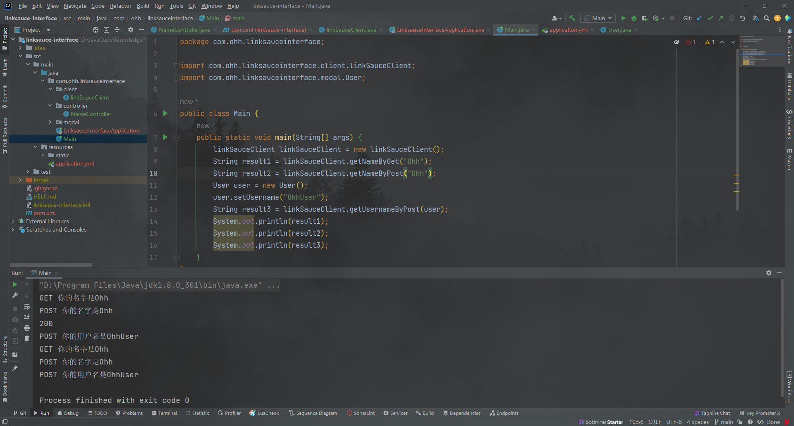


## 四、API签名认证

**本质：**

1.  签发签名
2.  使用签名（校验签名）


**作用：**

保证安全性，不能随便一个人就可以调用


**实现方法：**

-   **accessKey** 	调用的标识（复杂，无序，无规律）
-   **secretKey**	密钥 （复杂，无序，无规律）	

类似**用户名**和**密码**，区别：accessKey、secretKey是**无状态**的

千万不能把密钥直接在服务器间进行传递，有可能被拦截

加密看第二点


### 1、修改数据库

由于我们的**user表**里面没有**access_key**、**secret_key** 所以我们要修改数据库表

```sql
create table if not exists user
(
    id            bigint auto_increment comment 'id' primary key,
    user_name     varchar(256)                           null comment '用户昵称',
    user_account  varchar(256)                           not null comment '账号',
    user_avatar   varchar(1024)                          null comment '用户头像',
    gender        tinyint                                null comment '性别',
    user_role     varchar(256) default 'user'            not null comment '用户角色：user / admin',
    user_password varchar(512)                           not null comment '密码',
    access_key    varchar(256)                           null comment 'access_key',
    secret_key    varchar(256)                           null comment 'secret_key',
    create_time   datetime     default CURRENT_TIMESTAMP not null comment '创建时间',
    update_time   datetime     default CURRENT_TIMESTAMP not null on update CURRENT_TIMESTAMP comment '更新时间',
    is_delete     tinyint      default 0                 not null comment '是否删除',
    constraint uni_user_account
        unique (user_account)
) comment '用户';
```

直接drop掉之前的table重新建表，插入一条测试数据。

标准的话 应该新建一个表 主要字段为接口id、使用用户id、access_key、secret_key等等


### 2、加密

---

#### 2.1. 加密方式

将accessKey、secretKey放在Header里明文传递安全吗

答案是否定的，因为我们的**请求可能被人拦截**，而我们把密码放进请求头里面，可能会被别人获取

> 一般是根据密钥，生成**签名sign**

**加密方式**

1.  ​	对称加密

2.  ​	非对称加密

3.  ​	md5 签名（不可解密）


**签名的做法**

假如 ，我们有用户参数，我们用密钥与他拼接，用签名算法得到一个不可解密的值

​			**用户参数 	+	密钥	=>	签名生成算法（MD5,HMac,Sha1) 	=>	不可解密的值**

例子：	xuan 	+	abc	=>	7e7b9583aa0bc3e834fe8bcaebda38b5（这里是我随便输的，得到的值是随机的）

怎么知道签名对不对？

服务端用一模一样的参数和算法去生成签名，只要和用户传的一致，就表示密钥一致


**怎么防重放？**

加nonce随机数	只能用一次

服务端要保存用过的随机数	

加timestamp 时间戳，校验它的有效期


综上所属

**传递的参数**

1.  accessKey
2.  sign （由accessKey(或者使用用户请求参数body等)、secretKey加密而来）
3.  nonce随机数
4.  timestamp
5.  body（用户请求参数 可要可不要）

**API签名认证是一个很灵活的设计，具体要有哪些参数，尽量服务端调用，参数名如何要根据场景来。**


#### 2.2. 加密代码

我这里直接使用了body、和secretKey进行加密

先创建一个加密签名类`SignUtil.java`

```java
package com.ohh.linksauceinterface.utils;

import cn.hutool.crypto.digest.DigestAlgorithm;
import cn.hutool.crypto.digest.Digester;

/**
 * 签名工具
 */
public class SignUtils {
    /**
     * 生成签名
     *
     * @param body
     * @param secretKey
     * @return
     */
    public static String genSign(String body, String secretKey) {
        Digester md5 = new Digester(DigestAlgorithm.SHA256);
        String content = body + "." + secretKey;
        return md5.digestHex(content);
    }
}

```


在Client类中新增构造Header的方法

```java
public class linkSauceClient {

    private String accessKey;
    private String secretKey;
  
	// ...

 private Map<String, String> getHeaderMap(String body) {
        Map<String, String> hashMap = new HashMap<>();
        hashMap.put("accessKey", accessKey);
        // 不能直接发送
        // hashMap.put("secretKey", secretKey);
        hashMap.put("nonce", RandomUtil.randomNumbers(4));
        hashMap.put("body", body);
        hashMap.put("timestamp", String.valueOf(System.currentTimeMillis() / 1000));
        hashMap.put("sign", genSign(body, secretKey));
        return hashMap;
    }

    public String getUsernameByPost(@RequestBody User user) {
        String json = JSONUtil.toJsonStr(user);
        HttpResponse httpResponse = HttpRequest.post("http://localhost:8123/api/name/user")
                .addHeaders(getHeaderMap(json))
                .body(json)
                .execute();
        System.out.println(httpResponse.getStatus());
        String result = httpResponse.body();
        System.out.println(result);
        return result;
    }

}
```


调用API的时候加密代码已经写好了，显然我们在API中需要用同样的方法来验证加密。这里以携带JSON body的POST请求为例

```java
package com.ohh.linksauceinterface.controller;

import com.ohh.linksauceinterface.modal.User;
import com.ohh.linksauceinterface.utils.SignUtils;
import org.springframework.web.bind.annotation.*;

import javax.servlet.http.HttpServletRequest;

/**
 * 名称API
 */
@RestController
@RequestMapping("/name")
public class NameController {

    @GetMapping("/")
    public String getNameByGet(String name) {
        return "GET 你的名字是" + name;
    }

    @PostMapping("/")
    public String getNameByPost(@RequestParam String name) {
        return "POST 你的名字是" + name;
    }

    @PostMapping("/user")
    public String getUsernameByPost(@RequestBody User user, HttpServletRequest request) {
        String accessKey = request.getHeader("accessKey");
        String nonce = request.getHeader("nonce");
        String timestamp = request.getHeader("timestamp");
        String sign = request.getHeader("sign");
        String body = request.getHeader("body");
        // todo 实际开发应去数据库中查看是否已分配给用户
        if (!accessKey.equals("ohh")) {
            throw new RuntimeException("无权限访问");
        }
        if (Long.parseLong(nonce) > 10000) {
            throw new RuntimeException("无权限访问");
        }
        // todo 时间和当前时间不能超过5分钟
        // if (timestamp){
        //
        // }

        // todo 实际情况是从数据库中查secretKey
        String serverSign = SignUtils.genSign(body, "abcdefgh");
        if (!sign.equals(serverSign)) {
            throw new RuntimeException("签名错误");
        }

        return "POST 你的用户名是" + user.getUsername();
    }


}

```

进行测试secretKey = "abc" 可以正确访问，当secret错误时返回无权限～


## 五、开发一个SDK（starter）

理想情况：开发者只需要关心调用哪些接口、传递哪些参数。就跟调用自己写的代码一样简单。

> 开发starter的好处：开发者引入之后，可以直接在application.yml中写配置，自动创建客户端

### 1、新建项目

创建一个`linksauce-client-sdk`的springboot项目 勾选lombok、Spring Configuration Processor

（作用：自动生成配置的代码提示）

然后处理`pom.xml`  <build></build>这个<font color='red'>一定需要删除</font>因为这个是maven的构建项目成可运行jar包。现在是制作starter依赖包

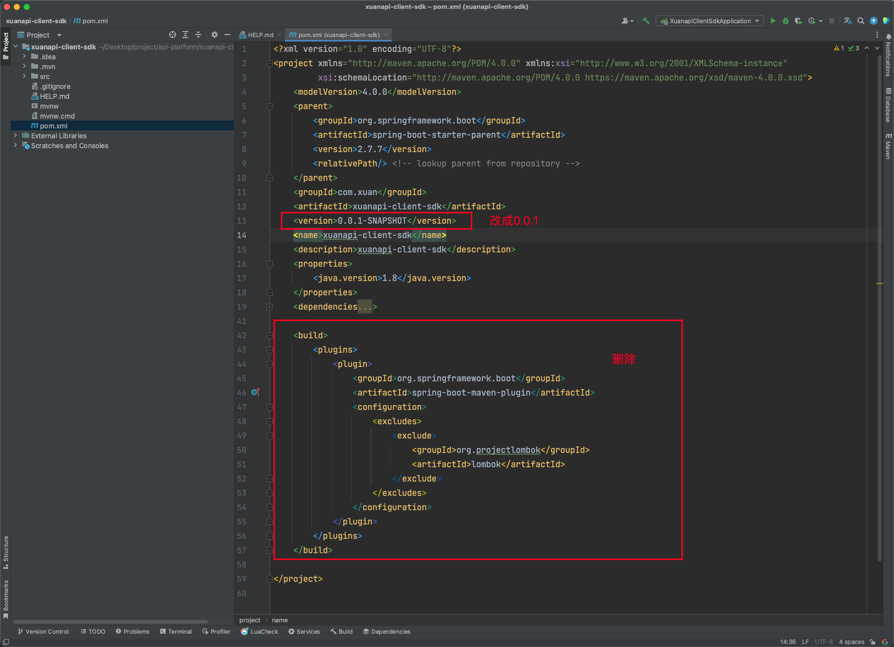


### 2、编写配置类

我们不需要spring boot启动类，将其删去。

然后将之前编写好的client、util、model粘贴过来

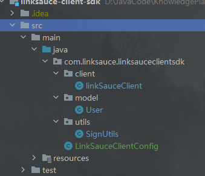

再新建配置类`LinkSauceClientConfig`

```java
@Configuration
@ConfigurationProperties("linksauce.client")
@Data
@ComponentScan
public class LinkSauceClientConfig {

    private String accessKey;
    private String secretKey;

    @Bean
    public linkSauceClient linkSauceClient() {
        return new linkSauceClient(accessKey, secretKey);
    }

}
```


### 3、指定配置类

新建`resources/META-INF/spring.factories`并指定

```properties
# spring boot starter
org.springframework.boot.autoconfigure.EnableAutoConfiguration=com.xuan.XuanApiClientConfig
```

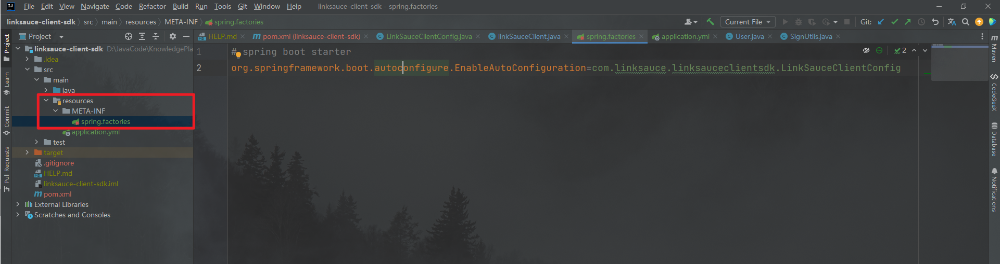


### 4、发布starter

双击Maven lifecycle下的**install**或者命令行`mvn install`

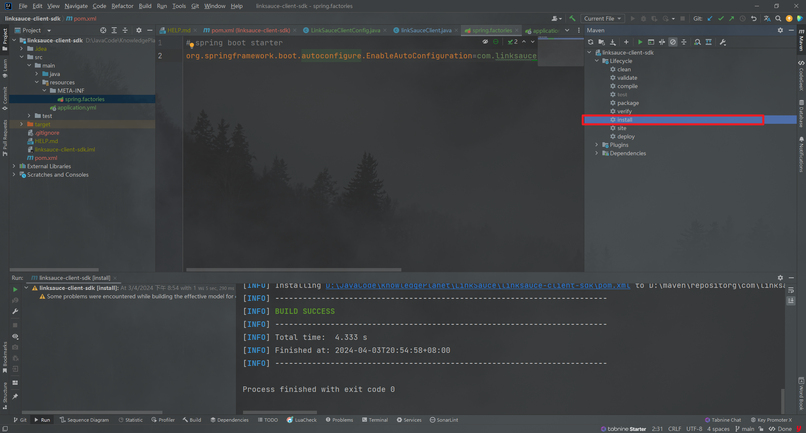


### 5、测试

**引入依赖**

回到`linksauce-Interface`项目，把之前的**client**、**util**、**model**全部删掉。然后在**pom**中引入我们刚刚制作好的starter

<font color='red'>注意：</font>这里能直接引入，是因为刚刚我们install的stater在我们的本地，可以发布到Maven仓库或者提供jar包供大家使用。

```xml
<!--自己制作的starter-->
<dependency>
  <groupId>com.linksauce</groupId>
  <artifactId>linksauce-client-sdk</artifactId>
  <version>0.0.1</version>
</dependency>
```


**配置信息**

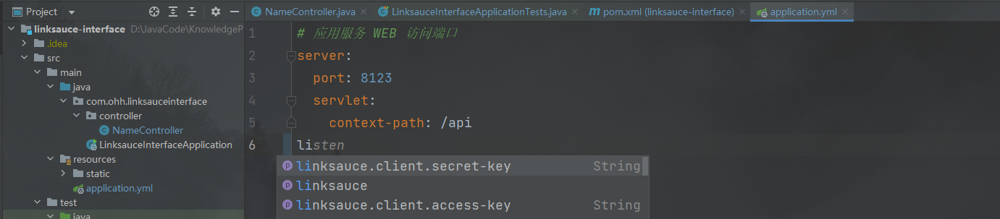

> 在yml文件中配置的时候有提示就是之前引入的Spring Configuration Processor发挥的作用。


在测试类使用@Resource注入linkSauceClient进行测试

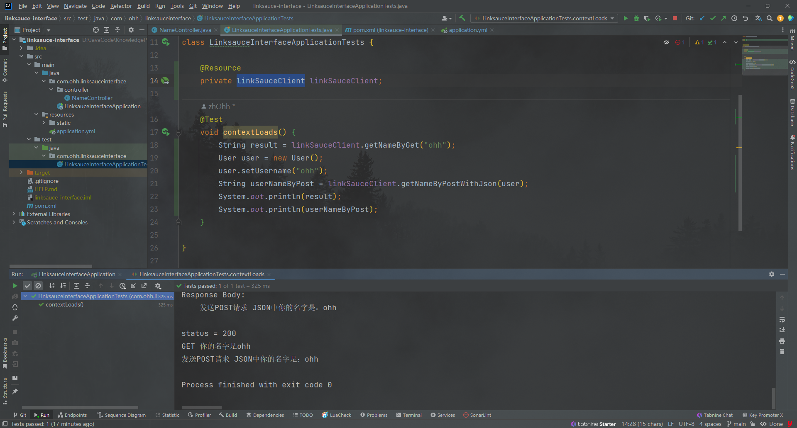


## 六、接口发布/下线

这个功能首先是仅管理员使用的

**发布接口**

1.  校验该接口是否存在
2.  判断接口是否可以被调用
3.  修改数据库接口字段为1

**下线接口**

1.  校验该接口是否存在
2.  修改数据库接口字段为 0

### 1、后端


1.   **通用请求类**

     上下线都是通过id来控制的

     ```java
     /**
      * 通过id发送请求
      *
      * @author ohh
      */
     @Data
     public class IdRequest implements Serializable {
         /**
          * id
          */
         private Long id;
     
         private static final long serialVersionUID = 1L;
     }
     ```

2.   **枚举类**

     使用枚举类来表示上线/下线状态

     ```java
     package com.ohh.project.model.enums;
     
     import java.util.Arrays;
     import java.util.List;
     import java.util.stream.Collectors;
     
     /**
      * 接口信息状态枚举
      *
      * @author ohh
      */
     public enum InterfaceInfoStatusEnum {
     
         OFFLINE("关闭", 0),
         ONLINE("上线", 1);
     
         private final String text;
     
         private final int value;
     
         InterfaceInfoStatusEnum(String text, int value) {
             this.text = text;
             this.value = value;
         }
     
         /**
          * 获取值列表
          *
          * @return
          */
         public static List<Integer> getValues() {
             return Arrays.stream(values()).map(item -> item.value).collect(Collectors.toList());
         }
     
         public int getValue() {
             return value;
         }
     
         public String getText() {
             return text;
         }
     }
     ```

3.   **在controller里编写上下线代码**

     <font color='red'>这里有个TODO</font> 判断该接口是否可以调用时，由`linksauceClient`固定方法名改为根据测试地址来调用

     ```java
     package com.ohh.project.controller;
     
     import ...
     
     /**
      * 接口管理
      *
      * @author ohh
      */
     @RestController
     @RequestMapping("/interfaceInfo")
     @Slf4j
     public class InterfaceInfoController {
     
         @Resource
         private InterfaceInfoService interfaceInfoService;
     
         @Resource
         private UserService userService;
     
         @Resource
         private linkSauceClient linkSauceClient;
     
       // ...
      
         /**
          * 发布
          *
          * @param idRequest
          * @param request
          * @return
          */
         @PostMapping("/online")
         @AuthCheck(mustRole = "admin")
         public BaseResponse<Boolean> onlineInterfaceInfo(@RequestBody IdRequest idRequest, HttpServletRequest request) {
     
             if (idRequest == null || idRequest.getId() <= 0) {
                 throw new BusinessException(ErrorCode.PARAMS_ERROR);
             }
             long id = idRequest.getId();
             // 判断是否存在
             InterfaceInfo oldInterfaceInfo = interfaceInfoService.getById(id);
             if (oldInterfaceInfo == null) {
                 throw new BusinessException(ErrorCode.NOT_FOUND_ERROR);
             }
             // 判断该接口是否可以调用
             com.linksauce.linksauceclientsdk.model.User user = new com.linksauce.linksauceclientsdk.model.User();
             user.setUsername("test");
             String username = linkSauceClient.getNameByPostWithJson(user);
             if (StringUtils.isBlank(username)) {
                 throw new BusinessException(ErrorCode.SYSTEM_ERROR, "接口验证失败");
             }
             // 仅本人或管理员可修改
             InterfaceInfo interfaceInfo = new InterfaceInfo();
             interfaceInfo.setId(id);
             interfaceInfo.setStatus(InterfaceInfoStatusEnum.ONLINE.getValue());
             boolean result = interfaceInfoService.updateById(interfaceInfo);
             return ResultUtils.success(result);
         }
     
         /**
          * 下线
          *
          * @param idRequest
          * @param request
          * @return
          */
         @PostMapping("/offline")
         @AuthCheck(mustRole = "admin")
         public BaseResponse<Boolean> offlineInterfaceInfo(@RequestBody IdRequest idRequest, HttpServletRequest request) {
             if (idRequest == null || idRequest.getId() <= 0) {
                 throw new BusinessException(ErrorCode.PARAMS_ERROR);
             }
             long id = idRequest.getId();
             // 判断是否存在
             InterfaceInfo oldInterfaceInfo = interfaceInfoService.getById(id);
             if (oldInterfaceInfo == null) {
                 throw new BusinessException(ErrorCode.NOT_FOUND_ERROR);
             }
     
             // 仅本人或管理员可修改
             InterfaceInfo interfaceInfo = new InterfaceInfo();
             interfaceInfo.setId(id);
             interfaceInfo.setStatus(InterfaceInfoStatusEnum.OFFLINE.getValue());
             boolean result = interfaceInfoService.updateById(interfaceInfo);
             return ResultUtils.success(result);
         }
     }
     ```

4.   **权限控制**

     这里添加权限校验，这里用到**@AuthCheck(mustRole = "admin")**的切面注解，对应的实现方法在`aop/AuthInterceptor`

     ```java
     package com.ohh.project.annotation;
     
     // import ...
     
     /**
      * 权限校验
      *
      * @author ohh
      */
     @Target(ElementType.METHOD)
     @Retention(RetentionPolicy.RUNTIME)
     public @interface AuthCheck {
     
         /**
          * 有任何一个角色
          *
          * @return
          */
         String[] anyRole() default "";
     
         /**
          * 必须有某个角色
          *
          * @return
          */
         String mustRole() default "";
     
     }
     ```

     `aop/AuthInterceptor.java`

     ```java
     package com.ohh.project.aop;
     
     // import...
     
     import javax.annotation.Resource;
     import javax.servlet.http.HttpServletRequest;
     import java.util.Arrays;
     import java.util.List;
     import java.util.stream.Collectors;
     
     
     /**
      * 权限校验 AOP
      *
      * @author ohh
      */
     @Aspect
     @Component
     public class AuthInterceptor {
     
         @Resource
         private UserService userService;
     
         /**
          * 执行拦截
          *
          * @param joinPoint
          * @param authCheck
          * @return
          */
         @Around("@annotation(authCheck)")
         public Object doInterceptor(ProceedingJoinPoint joinPoint, AuthCheck authCheck) throws Throwable {
             List<String> anyRole = Arrays.stream(authCheck.anyRole()).filter(StringUtils::isNotBlank).collect(Collectors.toList());
             String mustRole = authCheck.mustRole();
             RequestAttributes requestAttributes = RequestContextHolder.currentRequestAttributes();
             HttpServletRequest request = ((ServletRequestAttributes) requestAttributes).getRequest();
             // 当前登录用户
             User user = userService.getLoginUser(request);
             // 拥有任意权限即通过
             if (CollectionUtils.isNotEmpty(anyRole)) {
                 String userRole = user.getUserRole();
                 if (!anyRole.contains(userRole)) {
                     throw new BusinessException(ErrorCode.NO_AUTH_ERROR);
                 }
             }
             // 必须有所有权限才通过
             if (StringUtils.isNotBlank(mustRole)) {
                 String userRole = user.getUserRole();
                 if (!mustRole.equals(userRole)) {
                     throw new BusinessException(ErrorCode.NO_AUTH_ERROR);
                 }
             }
             // 通过权限校验，放行
             return joinPoint.proceed();
         }
     }
     ```

     `userService.getLoginUser(request)`

     ```java
     /**
      * 获取当前登录用户
      *
      * @param request
      * @return
      */
     @Override
     public User getLoginUser(HttpServletRequest request) {
         // 先判断是否已登录
         Object userObj = request.getSession().getAttribute(USER_LOGIN_STATE);
         User currentUser = (User) userObj;
         if (currentUser == null || currentUser.getId() == null) {
             throw new BusinessException(ErrorCode.NOT_LOGIN_ERROR);
         }
         // 从数据库查询（追求性能的话可以注释，直接走缓存）
         long userId = currentUser.getId();
         currentUser = this.getById(userId);
         if (currentUser == null) {
             throw new BusinessException(ErrorCode.NOT_LOGIN_ERROR);
         }
         return currentUser;
     }
     ```


### 2、前端

#### 2.1. 添加发布按钮和下线按钮

> Ant Design [Button的官方文档](https://ant.design/components/button-cn)

发布/下线做成一个按钮。通过status来动态判断

```tsx
{
  title: '操作',
  dataIndex: 'option',
  valueType: 'option',
  render: (_, record) => [
    <a
      key="config"
      onClick={() => {
        handleUpdateModalOpen(true);
        setCurrentRow(record);
      }}
    >
      修改
    </a>,
    record.status === 0 ? (
      <a
        key="config"
        onClick={() => {
          handleOnline(record);
        }}
      >
        发布
      </a>
    ) : null,
    record.status === 1 ? (
      <Button
        type="text"
        danger
        key="config"
        onClick={() => {
          handleOFFline(record);
        }}
      >
        下线
      </Button>
    ) : null,
    <Button
      type="text"
      danger
      key="delete"
      onClick={() => {
        handleRemoveInterfaceInfo(record);
      }}
    >
      删除
    </Button>,
  ],
},
```

运行截图：

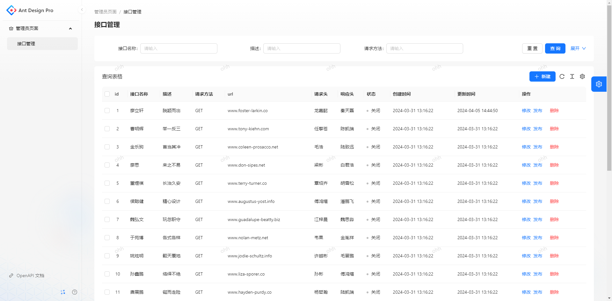

#### 2.2. 编写发布/下线的方法

<font color='red'>因为后端新增了代码，所以还是使用openapi自动生成前端方法</font>

跟之前操作一样，去http://localhost:7529/api/v3/api-docs复制json到config/oneapi.json 然后运行openapi   

新增方法

```tsx
/**
 * 发布接口
 * @param selectedRows
 */
const handleOnline = async (record: API.IdRequest) => {
  const hide = message.loading('发布中');
  if (!record) return true;
  try {
    await onlineInterfaceInfoUsingPost({
      id: record.id,
    });
    hide();
    message.success('发布成功!');
    // 刷新页面
    actionRef.current?.reload();
    return true;
  } catch (error: any) {
    hide();
    message.error('发布失败!' + error.message);
    return false;
  }
};

/**
 * 下线接口
 * @param selectedRows
 */
const handleOFFline = async (record: API.IdRequest) => {
  const hide = message.loading('下线中');
  if (!record) return true;
  try {
    await offlineInterfaceInfoUsingPost({
      id: record.id,
    });
    hide();
    message.success('下线成功!');
    // 刷新页面
    actionRef.current?.reload();
    return true;
  } catch (error: any) {
    hide();
    message.error('下线失败!' + error.message);
    return false;
  }
};
```


## 七、用户主页

>  前端浏览接口，查看接口文档，申请签名（注册）

### 1、浏览接口

---

在`src/pages`目录下新建**Index**目录并把`Welcome.tsx`拖入其中

改名为`index.tsx`


**配置路由**`routes.tsx`

```ts
  { name: '主页', path: '/', icon: 'smile', component: './Index' },
```


**编写页面**`Index/index.tsx`

>  参考 [Ant Design List组件](https://ant.design/components/list-cn)

```tsx
import { listInterfaceInfoByPageUsingGet } from '@/services/linksauce-backend/interfaceInfoController';
import { PageContainer } from '@ant-design/pro-components';
import { List, message } from 'antd';
import React, { useEffect, useState } from 'react';

/**
 * 主页
 * @constructor
 */
const Index: React.FC = () => {
  const [loading, setLoading] = useState(false);
  const [list, setList] = useState<API.InterfaceInfo[]>([]);
  const [total, setTotal] = useState<number>(0);

  const loadData = async (current = 1, pageSize = 10) => {
    setLoading(true);
    try {
      const res = await listInterfaceInfoByPageUsingGet({
        current,
        pageSize,
      });
      setList(res?.data?.records ?? []);
      setTotal(res?.data?.total ?? 0);
      setLoading(false);
    } catch (error: any) {
      setLoading(false);
      message.error('请求失败,' + error.message);
    }
  };

  useEffect(() => {
    loadData();
  }, []);

  return (
    <PageContainer title={'在线接口开放平台'}>
      <List
        className="interfaceInfo-list"
        loading={loading}
        itemLayout="horizontal"
        dataSource={list}
        pagination={{
          showSizeChanger: true,
          total: total,
          showTotal(total, range) {
            return `${range[0]}-${range[1]} / ${total}`;
          },
          onChange(page, pageSize) {
            loadData(page, pageSize);
          },
        }}
        renderItem={(item) => {
          const apiLink = `/interface_info/${item.id}`;
          return (
            <List.Item actions={[<a key={item.id} href={apiLink}>查看详情</a>]}>
              <List.Item.Meta
                title={<a href={apiLink}>{item.name}</a>}
                description={item.description}
              />
              <div>{item.method}</div>
            </List.Item>
          );
        }}
      />
    </PageContainer>
  );
};

export default Index;
```


**效果如下**

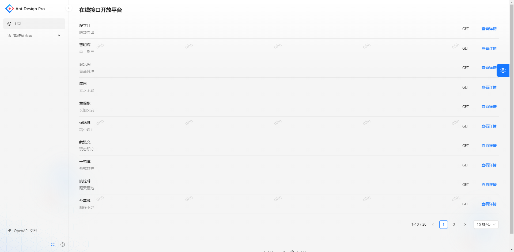


### 2、查看接口文档

---

1.   **新建文件**

     在**pages**下新建 `InterfaceInfo/index.tsx`

2.   **配置动态路由**`routes.ts`

     > 查看 [umi文档](https://umijs.org/docs/guides/routes)

     ```ts
     {
       name: '查看接口',
       path: '/interface_info/:id',
       icon: 'smile',
       component: './InterfaceInfo',
       hideInMenu: true,
     },
     ```

3.   **修改跳转**

     主页代码片段修改

     ```tsx
     return (
       <PageContainer title={'在线接口开放平台'}>
         <List
           className="interfaceInfo-list"
           loading={loading}
           itemLayout="horizontal"
           dataSource={list}
           pagination={{
             showSizeChanger: true,
             total: total,
             showTotal(total, range) {
               return `${range[0]}-${range[1]} / ${total}`;
             },
             onChange(page, pageSize) {
               loadData(page, pageSize);
             },
           }}
           renderItem={(item) => {
             const apiLink = `/interface_info/${item.id}`;
             return (
               <List.Item actions={[<a key={item.id} href={apiLink}>查看详情</a>]}>
                 <List.Item.Meta
                   title={<a href={apiLink}>{item.name}</a>}
                   description={item.description}
                 />
                 <div>{item.method}</div>
               </List.Item>
             );
           }}
         />
       </PageContainer>
     );
     ```

     点击页面即可查看详情

     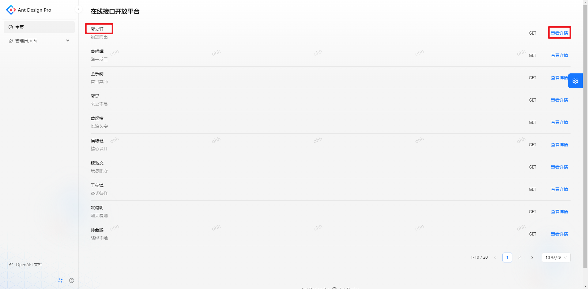

4.   **编写`InterfaceInfo/index.tsx`**

     这里需要查看Ant Design中的**Card** 和 **Descriptions** 组件 

     已经umi中动态路由如何获取路径中的id

     **代码如下：**

     ```tsx
     import { PageContainer } from '@ant-design/pro-components';
     import { Badge, Card, Descriptions, message } from 'antd';
     import React, { useEffect, useState } from 'react';
     import { useParams } from 'react-router';
     import moment from "moment";
     import {getInterfaceInfoByIdUsingGet} from "@/services/linksauce-backend/interfaceInfoController";
     
     const InterfaceInfo: React.FC = () => {
       const [loading, setLoading] = useState(false);
       const [data, setData] = useState<API.InterfaceInfo>();
     
       const params = useParams();
     
       const loadData = async () => {
         if (!params.id) {
           message.error('无数据，请重试');
         }
         setLoading(true);
         try {
           const res = await getInterfaceInfoByIdUsingGet({
             id: Number(params.id),
           });
           setData(res?.data);
           setLoading(false);
         } catch (error: any) {
           setLoading(false);
           message.error('请求失败,' + error.message);
         }
       };
     
       useEffect(() => {
         loadData();
       }, []);
     
       return (
         <PageContainer title={'接口详情'}>
           <Card loading={loading}>
             {data ? (
               <Descriptions title={data.name} column={2} layout="vertical" bordered={true}>
                 <Descriptions.Item label="描述">{data.description}</Descriptions.Item>
                 <Descriptions.Item label="接口状态">
                   {data.status === 0 ? (
                     <Badge text={'关闭'} status={'default'} />
                   ) : (
                     <Badge text={'启用'} status={'processing'} />
                   )}
                 </Descriptions.Item>
                 <Descriptions.Item label="请求地址">{data.url}</Descriptions.Item>
                 <Descriptions.Item label="请求方法">{data.method}</Descriptions.Item>
                 <Descriptions.Item label="请求头">{data.requestHeader}</Descriptions.Item>
                 <Descriptions.Item label="响应头">{data.responseHeader}</Descriptions.Item>
                 <Descriptions.Item label="创建时间">{moment(data.createTime).format('yyyy-MM-DD HH:mm:ss')}</Descriptions.Item>
                 <Descriptions.Item label="更新时间">{moment(data.updateTime).format('yyyy-MM-DD HH:mm:ss')}</Descriptions.Item>
               </Descriptions>
             ) : (
               <>接口不存在</>
             )}
           </Card>
         </PageContainer>
       );
     };
     
     export default InterfaceInfo;
     ```

5.   **效果如下**

     点击后跳转详情

     


### 3、申请签名

---

**注册用户的时候就给他分配一个签名**

先在**User**类和`UserMapper.xml`中加一下**accessKey**、**secretKey**的字段

修改`User.java`,增加如下字段

```java
/**
 * 签名 accessKey
 */
private String accessKey;

/**
 * 签名 secretKey
 */
private String secretKey;
```

修改`UserMapper.xml`

```xml
<?xml version="1.0" encoding="UTF-8"?>
<!DOCTYPE mapper
        PUBLIC "-//mybatis.org//DTD Mapper 3.0//EN"
        "http://mybatis.org/dtd/mybatis-3-mapper.dtd">
<mapper namespace="com.ohh.project.mapper.UserMapper">

    <resultMap id="BaseResultMap" type="com.ohh.project.model.entity.User">
        <id property="id" column="id" jdbcType="BIGINT"/>
        <result property="userName" column="userName" jdbcType="VARCHAR"/>
        <result property="userAccount" column="userAccount" jdbcType="VARCHAR"/>
        <result property="userAvatar" column="userAvatar" jdbcType="VARCHAR"/>
        <result property="gender" column="gender" jdbcType="TINYINT"/>
        <result property="userRole" column="userRole" jdbcType="VARCHAR"/>
        <result property="userPassword" column="userPassword" jdbcType="VARCHAR"/>
        <result property="accessKey" column="accessKey" jdbcType="VARCHAR"/>
        <result property="secretKey" column="secretKey" jdbcType="VARCHAR"/>
        <result property="createTime" column="createTime" jdbcType="TIMESTAMP"/>
        <result property="updateTime" column="updateTime" jdbcType="TIMESTAMP"/>
        <result property="isDelete" column="isDelete" jdbcType="TINYINT"/>
    </resultMap>

    <sql id="Base_Column_List">
        id,userName,userAccount,
        userAvatar,gender,userRole,
        userPassword,accessKey,secretKey,createTime,updateTime,
        isDelete
    </sql>
</mapper>
```

更新注册方法`UserServiceImpl.java`

```java
@Override
public long userRegister(String userAccount, String userPassword, String checkPassword) {
    // 1. 校验
    if (StringUtils.isAnyBlank(userAccount, userPassword, checkPassword)) {
        throw new BusinessException(ErrorCode.PARAMS_ERROR, "参数为空");
    }
    if (userAccount.length() < 4) {
        throw new BusinessException(ErrorCode.PARAMS_ERROR, "用户账号过短");
    }
    if (userPassword.length() < 8 || checkPassword.length() < 8) {
        throw new BusinessException(ErrorCode.PARAMS_ERROR, "用户密码过短");
    }
    // 密码和校验密码相同
    if (!userPassword.equals(checkPassword)) {
        throw new BusinessException(ErrorCode.PARAMS_ERROR, "两次输入的密码不一致");
    }
    synchronized (userAccount.intern()) {
        // 账户不能重复
        QueryWrapper<User> queryWrapper = new QueryWrapper<>();
        queryWrapper.eq("userAccount", userAccount);
        long count = userMapper.selectCount(queryWrapper);
        if (count > 0) {
            throw new BusinessException(ErrorCode.PARAMS_ERROR, "账号重复");
        }
        // 2. 加密
        String encryptPassword = DigestUtils.md5DigestAsHex((SALT + userPassword).getBytes());
        // 3. 分配 accessKey, secretKey
        String accessKey = DigestUtil.md5Hex(SALT + userAccount + RandomUtil.randomNumbers(4));
        String secretKey = DigestUtil.md5Hex(SALT + userAccount + RandomUtil.randomNumbers(8));
        // 4. 插入数据
        User user = new User();
        user.setUserAccount(userAccount);
        user.setUserPassword(encryptPassword);
        user.setAccessKey(accessKey);
        user.setSecretKey(secretKey);
        boolean saveResult = this.save(user);
        if (!saveResult) {
            throw new BusinessException(ErrorCode.SYSTEM_ERROR, "注册失败，数据库错误");
        }
        return user.getId();
    }
}
```


**功能测试：**前往http://localhost:7529/api/doc.html进行注册。		

分配成功~

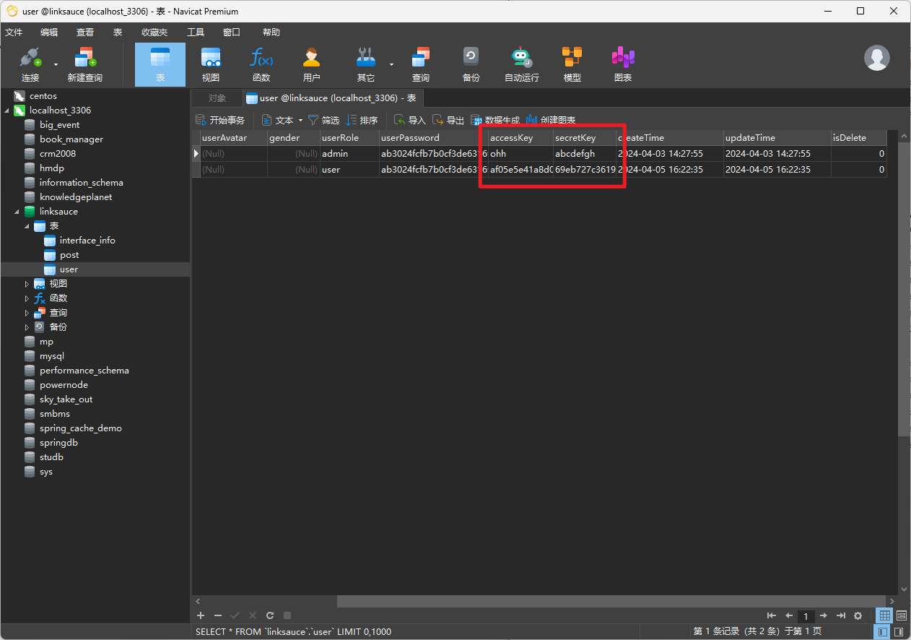

