# LinkSauce API开放平台开发文档

## 一、项目脚手架搭建

### 1、Ant Design Pro

> 查看 [官方文档](pro.ant.design/zh-CN/docs/getting-started)

1. 安装初始化脚手架

   ```shell
   # 使用 npm
   npm i @ant-design/pro-cli -g
   ```

2. 打开将要存放项目的文件夹 创建项目

   ```shell
   pro create linksauce-frontend
   ```

   **选择umi版本**

   >   ```shell
   >   ? 🐂 使用 umi@4 还是 umi@3 ? (Use arrow keys)
   >   ❯ umi@4
   >    umi@3
   >   ```

3. 安装yarn

   ```shell
   # 全局安装
   npm install -g yarn
   ```

   查看yarn版本

   ```shell
   yarn -version
   ```

4. 安装依赖

   ```shell
   yarn
   ```

5. 运行测试`package.json`中的`start`

   

   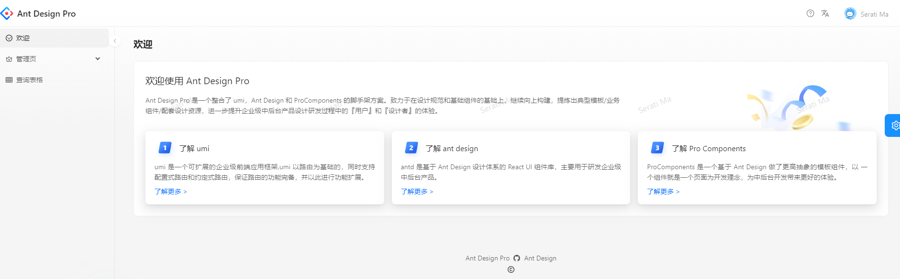

6. 项目瘦身，**有坑，可跳过！！！**

   - 运行`package.json`中的`i18n-remove`去除国际化，手动删除`src\locales`

     > 如果报错，检查一下是不是没删干净，可以手动去除

     **AntDesign去国际化 后 router页面显示问题：**

     >   解决方法：执行 
     >
     >   yarn add eslint-config-prettier
     >
     >   yarn add eslint-plugin-unicorn
     >
     >   然后修改node_modules/@umijs/lint/dist/config/eslint/index.js 
     >
     >   // es2022: true把这个注释掉就可以解决问题

     如果不行，修改`config\routes.ts`如下即可：

     ```ts
     export default [
       { name: '登录', path: '/user', layout: false, routes: [{ path: '/user/login', component: './User/Login' }] },
       { name: '欢迎页面', path: '/welcome', icon: 'smile', component: './Welcome' },
       {
         path: '/admin',
         icon: 'crown',
         access: 'canAdmin',
         name: '管理员页面',
         routes: [
           { path: '/admin', redirect: '/admin/sub-page' },
           { path: '/admin/sub-page', component: './Admin' },
         ],
       },
       { icon: 'table', path: '/list', component: './TableList', name: '表格页' },
       { path: '/', redirect: '/welcome' },
       { path: '*', layout: false, component: './404' },
     ];
     ```

   - 删除`src\tests`

7. 重新安装依赖，重复第五步，确认是否能正常运行

   ```shell
   yarn
   ```


### 2、后端

#### 2.1. 初始化

> 参考使用[springboot-init模板](https://github.com/zhOhh/sptingboot-init)

#### 2.2. 数据库表设计

**基本结构**

| 字段名         | 备注                         |
| -------------- | ---------------------------- |
| id             | 用户id                       |
| name           | 名称                         |
| description    | 描述                         |
| url            | 接口地址                     |
| request_header | 请求头                       |
| reponse_header | 响应头                       |
| status         | 接口状态（0-关闭 1-开启）    |
| method         | 请求类型                     |
| user_id        | 创建人                       |
| create_time    | 创建时间                     |
| update_time    | 更新时间                     |
| is_delete      | 逻辑删除 （0-未删 ，1-已删） |

**代码**

> 可以用鱼皮写的sql生成工具生成一下代码   [SQL之父](https://www.sqlfather.com/)

填对应的数据，一键生成即可

```sql
use linksauce;

-- 接口信息
create table if not exists linksauce.`interface_info`
(
    `id` bigint not null auto_increment comment '主键' primary key,
    `name` varchar(256) not null comment '名称',
    `description` varchar(256) null comment '描述',
    `url` varchar(512) not null comment '接口地址',
    `requestHeader` text null comment '请求头',
    `responseHeader` text null comment '响应头',
    `status` int default 0 not null comment '接口状态（0-关闭，1-开启）',
    `method` varchar(256) not null comment '请求类型',
    `userId` bigint not null comment '创建人',
    `createTime` datetime default CURRENT_TIMESTAMP not null comment '创建时间',
    `updateTime` datetime default CURRENT_TIMESTAMP not null on update CURRENT_TIMESTAMP comment '更新时间',
    `isDelete` tinyint default 0 not null comment '是否删除(0-未删, 1-已删)'
) comment '接口信息';

insert into linksauce.`interface_info` (`name`, `description`, `url`, `requestHeader`, `responseHeader`, `status`, `method`, `userId`) values ('廖立轩', '脱颖而出', 'www.foster-larkin.co', '龙嘉懿', '秦天磊', 0, 'GET', 1718083101);
insert into linksauce.`interface_info` (`name`, `description`, `url`, `requestHeader`, `responseHeader`, `status`, `method`, `userId`) values ('曹明辉', '举一反三', 'www.tony-kiehn.com', '任擎苍', '陈凯瑞', 0, 'GET', 28978);
insert into linksauce.`interface_info` (`name`, `description`, `url`, `requestHeader`, `responseHeader`, `status`, `method`, `userId`) values ('金乐驹', '首当其冲', 'www.coleen-prosacco.net', '毛浩', '陆致远', 0, 'GET', 208);
insert into linksauce.`interface_info` (`name`, `description`, `url`, `requestHeader`, `responseHeader`, `status`, `method`, `userId`) values ('廖思', '来之不易', 'www.don-sipes.net', '梁彬', '白君浩', 0, 'GET', 470);
insert into linksauce.`interface_info` (`name`, `description`, `url`, `requestHeader`, `responseHeader`, `status`, `method`, `userId`) values ('董煜祺', '长治久安', 'www.terry-turner.co', '覃绍齐', '胡雪松', 0, 'GET', 611007);
insert into linksauce.`interface_info` (`name`, `description`, `url`, `requestHeader`, `responseHeader`, `status`, `method`, `userId`) values ('侯聪健', '精心设计', 'www.augustus-yost.info', '傅鸿煊', '潘鹏飞', 0, 'GET', 0);
insert into linksauce.`interface_info` (`name`, `description`, `url`, `requestHeader`, `responseHeader`, `status`, `method`, `userId`) values ('魏弘文', '玩忽职守', 'www.guadalupe-beatty.biz', '江梓晨', '魏思淼', 0, 'GET', 1162536022);
insert into linksauce.`interface_info` (`name`, `description`, `url`, `requestHeader`, `responseHeader`, `status`, `method`, `userId`) values ('于苑博', '各式各样', 'www.nolan-metz.net', '韦果', '金胤祥', 0, 'GET', 0);
insert into linksauce.`interface_info` (`name`, `description`, `url`, `requestHeader`, `responseHeader`, `status`, `method`, `userId`) values ('姚炫明', '翻天覆地', 'www.jodie-schultz.info', '许越彬', '毛晋鹏', 0, 'GET', 973);
insert into linksauce.`interface_info` (`name`, `description`, `url`, `requestHeader`, `responseHeader`, `status`, `method`, `userId`) values ('孙鑫鹏', '络绎不绝', 'www.liza-sporer.co', '孙彬', '傅鸿煊', 0, 'GET', 30308);
insert into linksauce.`interface_info` (`name`, `description`, `url`, `requestHeader`, `responseHeader`, `status`, `method`, `userId`) values ('唐展鹏', '铤而走险', 'www.hayden-purdy.co', '杨哲瀚', '陆凯瑞', 0, 'GET', 473462835);
insert into linksauce.`interface_info` (`name`, `description`, `url`, `requestHeader`, `responseHeader`, `status`, `method`, `userId`) values ('曹擎苍', '赞不绝口', 'www.phung-glover.org', '邱志泽', '张健雄', 0, 'GET', 32155653);
insert into linksauce.`interface_info` (`name`, `description`, `url`, `requestHeader`, `responseHeader`, `status`, `method`, `userId`) values ('夏烨霖', '哭笑不得', 'www.augustine-funk.org', '宋聪健', '郝鹏涛', 0, 'GET', 3964);
insert into linksauce.`interface_info` (`name`, `description`, `url`, `requestHeader`, `responseHeader`, `status`, `method`, `userId`) values ('董浩', '对症下药', 'www.erik-hamill.biz', '黎立果', '廖鹤轩', 0, 'GET', 2275);
insert into linksauce.`interface_info` (`name`, `description`, `url`, `requestHeader`, `responseHeader`, `status`, `method`, `userId`) values ('罗荣轩', '喜闻乐见', 'www.gia-hermann.biz', '韩煜城', '阎耀杰', 0, 'GET', 847);
insert into linksauce.`interface_info` (`name`, `description`, `url`, `requestHeader`, `responseHeader`, `status`, `method`, `userId`) values ('沈正豪', '统筹兼顾', 'www.isabella-reinger.io', '邓子轩', '廖伟诚', 0, 'GET', 997378602);
insert into linksauce.`interface_info` (`name`, `description`, `url`, `requestHeader`, `responseHeader`, `status`, `method`, `userId`) values ('任立果', '出人意料', 'www.geoffrey-koss.name', '覃浩然', '萧雨泽', 0, 'GET', 403);
insert into linksauce.`interface_info` (`name`, `description`, `url`, `requestHeader`, `responseHeader`, `status`, `method`, `userId`) values ('张炫明', '名不虚传', 'www.ellan-gleason.com', '黎正豪', '韦炎彬', 0, 'GET', 35127293);
insert into linksauce.`interface_info` (`name`, `description`, `url`, `requestHeader`, `responseHeader`, `status`, `method`, `userId`) values ('方雨泽', '衣食住行', 'www.wilton-walsh.biz', '黎越泽', '白远航', 0, 'GET', 62264);
insert into linksauce.`interface_info` (`name`, `description`, `url`, `requestHeader`, `responseHeader`, `status`, `method`, `userId`) values ('袁天翊', '卷土重来', 'www.lynetta-mclaughlin.info', '邹熠彤', '叶潇然', 0, 'GET', 9884455);
```

#### 2.3. MabatisX插件

生成domain、mapper、service

打开新建的表，右击选择MybatisX-Generator

勾上驼峰

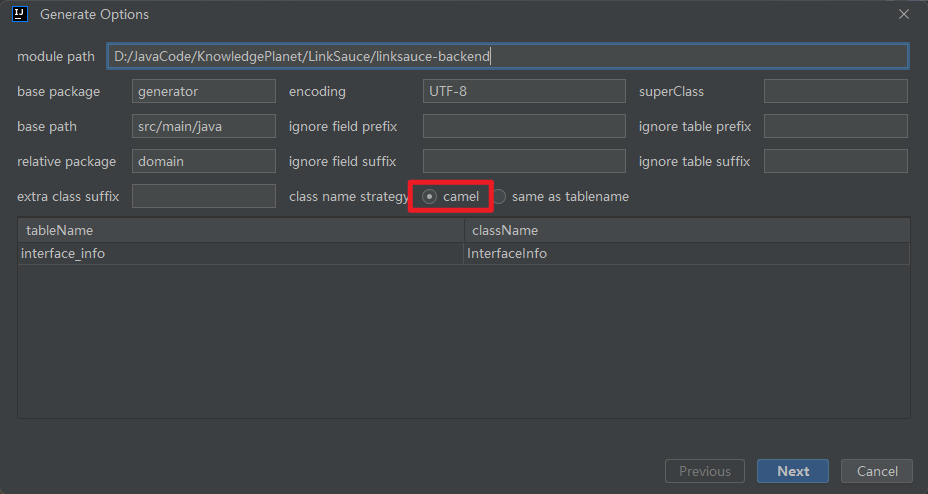

根据**版本和需要打勾**，点击完成

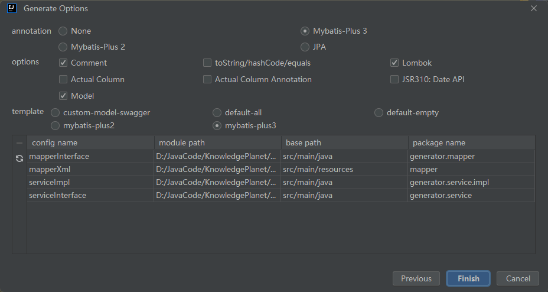

#### 2.4. Controller

> 我们只需要将**PostController**复制一份改名为**InterfaceInfoController**即可,因为逻辑是差不多，都是进行增删改查

然后将post改成interfaceInfo、Post改成InterfaceInfo

根据报错信息我们来补充信息


#### 2.5. Model

##### (1) Entity

```java
package com.ohh.project.model.entity;

import com.baomidou.mybatisplus.annotation.*;

import java.io.Serializable;
import java.util.Date;
import lombok.Data;

/**
 * 接口信息
 * @TableName interface_info
 */
@TableName(value ="interface_info")
@Data
public class InterfaceInfo implements Serializable {
    /**
     * 主键
     */
    @TableId(type = IdType.AUTO)
    private Long id;

    /**
     * 名称
     */
    private String name;

    /**
     * 描述
     */
    private String description;

    /**
     * 接口地址
     */
    private String url;

    /**
     * 请求头
     */
    private String requestHeader;

    /**
     * 响应头
     */
    private String responseHeader;

    /**
     * 接口状态（0-关闭，1-开启）
     */
    private Integer status;

    /**
     * 请求类型
     */
    private String method;

    /**
     * 创建人
     */
    private Long userId;

    /**
     * 创建时间
     */
    private Date createTime;

    /**
     * 更新时间
     */
    private Date updateTime;

    /**
     * 是否删除(0-未删, 1-已删)
     */
    @TableLogic
    private Integer isDelete;

    @TableField(exist = false)
    private static final long serialVersionUID = 1L;
}
```

##### (2) DTO

首先先增加DTO，在InterfaceInfo类从拿我们需要的信息做成三个DTO类（分别是新增、查询、更新）删除的请求我们封装在common包下

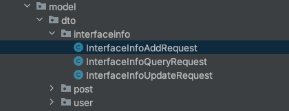


#### 2.6. Service

根据报错可知 service层缺少一个方法validInterfaceInfo

```java
package com.ohh.project.service.impl;

import com.baomidou.mybatisplus.extension.service.impl.ServiceImpl;
import com.ohh.project.common.ErrorCode;
import com.ohh.project.exception.BusinessException;
import com.ohh.project.mapper.InterfaceInfoMapper;
import com.ohh.project.model.entity.InterfaceInfo;
import com.ohh.project.service.InterfaceInfoService;
import org.apache.commons.lang3.ObjectUtils;
import org.apache.commons.lang3.StringUtils;
import org.springframework.stereotype.Service;

/**
* @author 12994
* @description 针对表【interface_info(接口信息)】的数据库操作Service实现
* @createDate 2024-03-29 18:05:35
*/
@Service
public class InterfaceInfoServiceImpl extends ServiceImpl<InterfaceInfoMapper, InterfaceInfo>
    implements InterfaceInfoService {

    @Override
    public void validInterfaceInfo(InterfaceInfo interfaceInfo, boolean add) {
        if (interfaceInfo == null) {
            throw new BusinessException(ErrorCode.PARAMS_ERROR);
        }

        String name = interfaceInfo.getName();
        String description = interfaceInfo.getDescription();
        String url = interfaceInfo.getUrl();
        String requestHeader = interfaceInfo.getRequestHeader();
        String responseHeader = interfaceInfo.getResponseHeader();
        Integer status = interfaceInfo.getStatus();
        String method = interfaceInfo.getMethod();
        Long userId = interfaceInfo.getUserId();

        // 创建时，所有参数必须非空
        if (add) {
            if (StringUtils.isAnyBlank(name, description, url, requestHeader, responseHeader, method) || ObjectUtils.anyNull(userId, status)) {
                throw new BusinessException(ErrorCode.PARAMS_ERROR);
            }
        }
        if (StringUtils.isNotBlank(name) && name.length() > 256) {
            throw new BusinessException(ErrorCode.PARAMS_ERROR, "名字过长");
        }
        if (StringUtils.isNotBlank(description) && description.length() > 512) {
            throw new BusinessException(ErrorCode.PARAMS_ERROR, "描述过长");
        }
    }

}

```

### 3、前端

#### 3.1. 配置插件

为了项目更加规范

> 搜索 **eslint** 选上自动识别

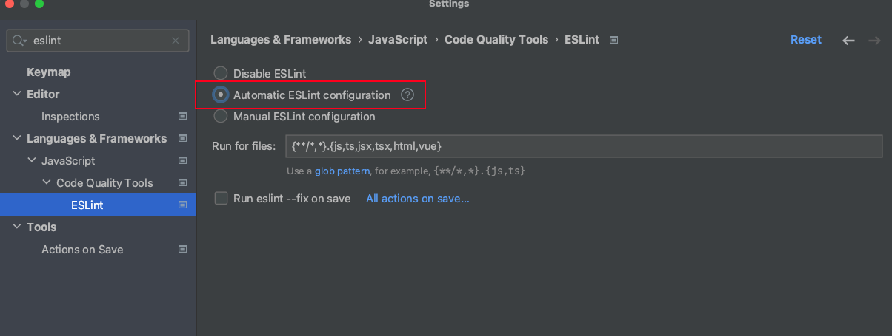


> 搜索**prettier** 打√  美化代码

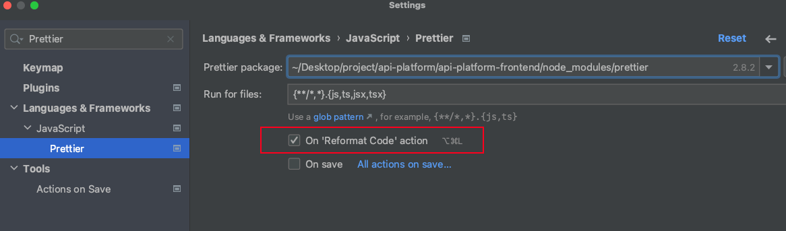

#### 3.2. 接口调用

使用 **oneapi** 插件自动生成

如果要前端自动生成，需要将后端的遵循**openapi**规范的**json**文档 

> 后端的遵循**openapi**规范的**json**文档 

找到我们起的后端主页

找到我们起的后端主页

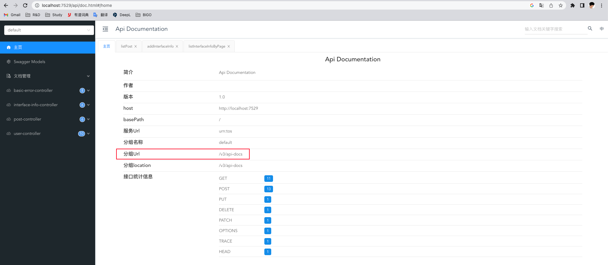

在地址栏输入http://localhost:7529/api/v3/api-docs

发现如下所示

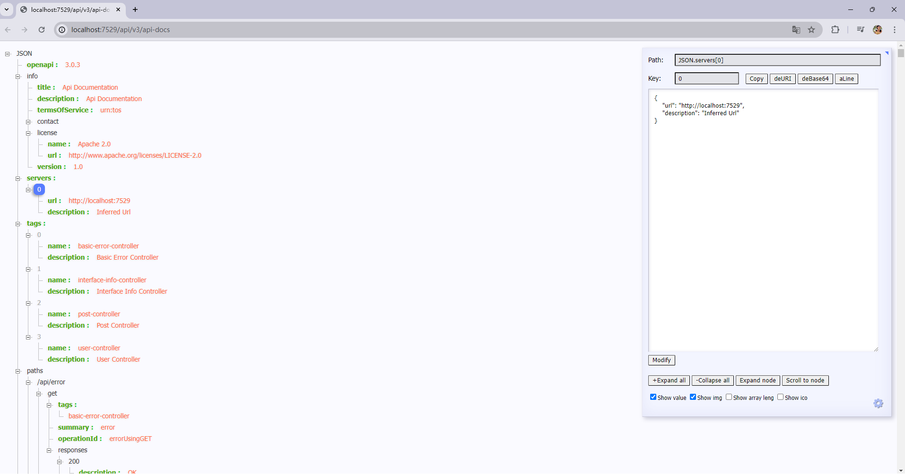

那么我们就可以使用这个url了

**修改：**`config\config.ts` ，找到**openApi** 修改如下

```tsx
openAPI: [
    {
      requestLibPath: "import { request } from '@umijs/max'",
      schemaPath: 'http://localhost:7529/api/v3/api-docs',
      projectName: 'linksauce-backend',
    },
  ],
```

测试一下是否能用

> 找到**package.json**,执行**openapi**命令
>
> 

执行成功，查看**service**文件夹

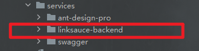

由于我们有后端 ，应请求真实环境，所以直接用**dev模式**运行

```bash
npm run start:dev
```

可以将项目中的`requestErrorConfig.ts`改为`requestConfig.ts`

然后在`app.tsx` 找到 request配置，将其修改成我们改的

```java
export const request = {
  ...requestConfig,
};
```

**找到`requestConfig.ts`**

修改名字，并设置一下后端地址

**设置cookie!!!**

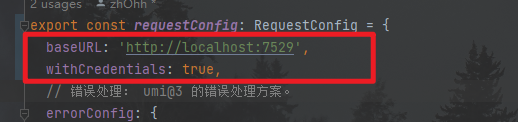

> ```java
> baseURL: 'http://localhost:7529',
> withCredentials: true,
> ```

#### 3.3. 修改登录接口

找到`src/pages/User/Login/index.tsx`下的**handleSubmit**

修改用户名和密码的字段和后端保持一致

**设置用户登录态**

回到`app.tsx`找到**getInitialState()**这个方法

这个方法当首次访问页面的时候，获取用户的信息，获取当前全局的一些状态，可以把它当成全局变量

找到`typings.d.ts`

```ts
/**
 * 全局状态类型
 */
interface InitialState{
  loginUser?:API.UserVO;
}
```

返回**getInitialState()**将它改为

```tsx
export async function getInitialState(): Promise<InitialState> {
  // 当页面首次加载时，获取要全局保存的数据，如用户登录信息
  const state: InitialState = {
    loginUser: undefined,
  };
  try {
    const res = await getLoginUserUsingGet();
    if (res.data) {
      state.loginUser = res.data;
    }
  } catch (error) {
    history.push(loginPath);
  }
  return state;
}
```


返回`src/pages/User/Login/index.tsx`下的**handleSubmit**

设置登录状态

```tsx
  const handleSubmit = async (values: API.UserLoginRequest) => {
    try {
      // 登录
      const res = await userLoginUsingPOST({ ...values });
      if (res.data) {
        const urlParams = new URL(window.location.href).searchParams;
        history.push(urlParams.get('redirect') || '/');
        setInitialState({
          loginUser: res.data
        });
        return;
      }
    } catch (error) {
      const defaultLoginFailureMessage = intl.formatMessage({
        id: 'pages.login.failure',
        defaultMessage: '登录失败，请重试！',
      });
      console.log(error);
      message.error(defaultLoginFailureMessage);
    }
  };
```

#### 3.4. 注销

找到`src/components/RightContent/AvatarDropdown.tsx`的**loginout()**将其改为自己的后端方法

```java
const onMenuClick = useCallback(
  (event: MenuInfo) => {
    const { key } = event;
    if (key === 'logout') {
      flushSync(() => {
        setInitialState((s) => ({ ...s, currentUser: undefined }));
      });
      userLogoutUsingPost();
      return;
    }
    history.push(`/account/${key}`);
  },
  [setInitialState],
);
```

#### 3.5. 设置管理权限 

修改`access.ts`

```ts
/**
 * @see https://umijs.org/docs/max/access#access
 * */
export default function access(initialState: InitialState | undefined) {
  const { loginUser } = initialState ?? {};
  return {
    // canAdmin: currentUser && currentUser.access === 'admin',
    canUser: loginUser,
    canAdmin: loginUser?.userRole === 'admin',
  };
}
 
```

#### 3.6. 修改表格内容

找到`src/pages/TableList/index.tsx`的**columns**，修改如下

```tsx
const columns: ProColumns<API.InterfaceInfo>[] = [
  {
    title: 'id',
    dataIndex: 'id',
    valueType: 'index',
  },
  {
    title: '接口名称',
    dataIndex: 'name',
    valueType: 'text',
  },
  {
    title: '描述',
    dataIndex: 'description',
    valueType: 'textarea',
  },
  {
    title: '请求方法',
    dataIndex: 'method',
    valueType: 'textarea',
  },
  {
    title: 'url',
    dataIndex: 'url',
    valueType: 'text',
  },
  {
    title: '请求头',
    dataIndex: 'requestHeader',
    valueType: 'textarea',
  },
  {
    title: '响应头',
    dataIndex: 'responseHeader',
    valueType: 'textarea',
  },
  {
    title: '状态',
    dataIndex: 'status',
    hideInForm: true,
    valueEnum: {
      0: {
        text: '关闭',
        status: 'Default',
      },
      1: {
        text: '运行中',
        status: 'Processing',
      },
    },
  },
  {
    title: '创建时间',
    dataIndex: 'createTime',
    valueType: 'dateTime',
  },
  {
    title: '更新时间',
    dataIndex: 'updateTime',
    valueType: 'dateTime',
  },
  {
    title: '操作',
    dataIndex: 'option',
    valueType: 'option',
    render: (_, record) => [
      <a
        key="config"
        onClick={() => {
          handleUpdateModalOpen(true);
          setCurrentRow(record);
        }}
      >
        配置
      </a>,
      <a key="subscribeAlert" href="https://procomponents.ant.design/">
        订阅警报
      </a>,
    ],
  },
];
```

修改`request`如下：

```tsx
request={async (
  params: {
    pageSize?: number;
    current?: number;
    keyword?: string;
  }, sort: Record<string, SortOrder>,  filter: Record<string, React.ReactText[] | null>,) => {
  const res = await listInterfaceInfoByPageUsingGet({ ...params });
  if (res.data) {
    return {
      data: res.data.records || [],
      success: true,
      total: res.data.total,
    };
  } else {
    return {
      data: [],
      success: false,
      total: 0,
    };
  }
}}
```

**刷新页面，显示成功**

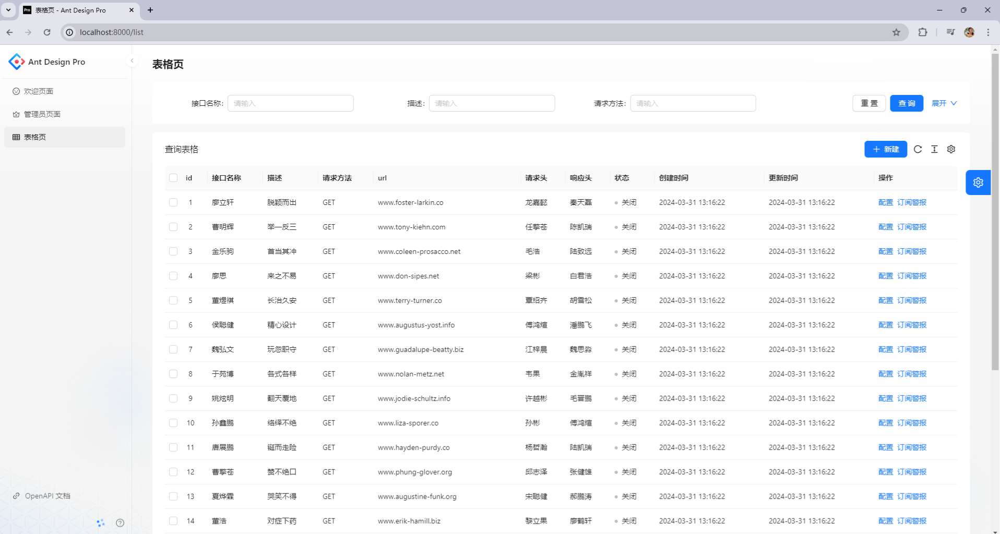


## 二、基础增删改查

### 1、修改路由

打开**config**包找到 **routes.ts**

将原来pages下的**TableList**表单名称改为我们的**interfaceInfo**，再把接口管理页面配置到管理员页面下

```js
{
  name: '接口管理',
  icon: 'table',
  path: '/admin/interface_info',
  component: './InterfaceInfo',
}
```


```typescript
export default [
  {
    path: '/user',
    layout: false,
    routes: [
      {
        name: 'login',
        path: '/user/login',
        component: './User/Login',
      },
    ],
  },
  {
    path: '/welcome',
    name: 'welcome',
    icon: 'smile',
    component: './Welcome',
  },
  {
    path: '/admin',
    name: 'admin',
    icon: 'crown',
    access: 'canAdmin',
    routes: [
      {
        path: '/admin',
        redirect: '/admin/sub-page',
      },
      {
        path: '/admin/sub-page',
        name: 'sub-page',
        component: './Admin',
      },
      {
        name: '接口管理',
        icon: 'table',
        path: '/admin/interface_info',
        component: './InterfaceInfo',
      },
    ],
  },
  {
    path: '/',
    redirect: '/welcome',
  },
  {
    path: '*',
    layout: false,
    component: './404',
  },
];

```

效果如下


### 2、新增接口信息

---

#### 2.1. 表单模块

**interfaceInfo**中的**index.tsx**找到新建的Button

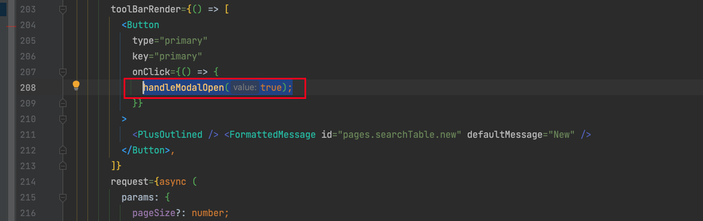

我们点击新建的时候，他会打开一个模态框。往下找，发现它已经给我们提供了这个组件。但是我们需要重新写

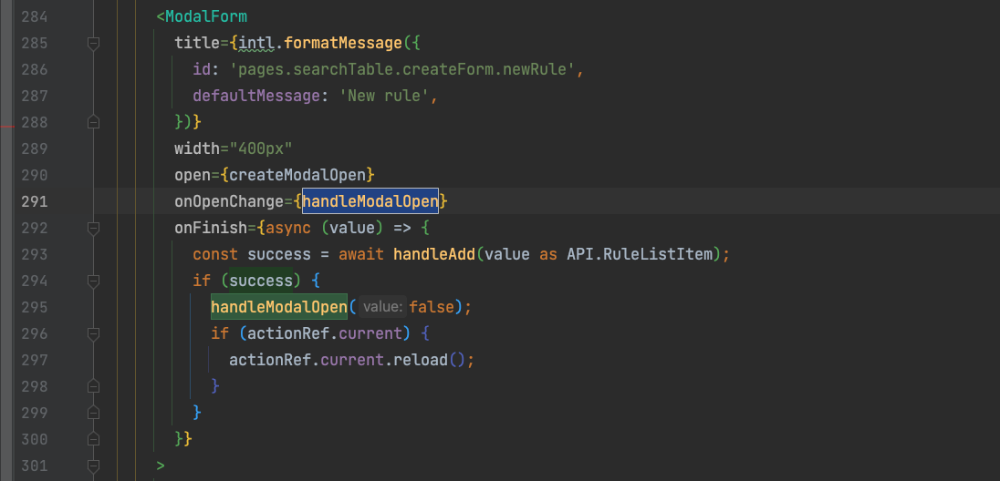

我们可以就像更新模态框一样新建一个CreateModal.tsx

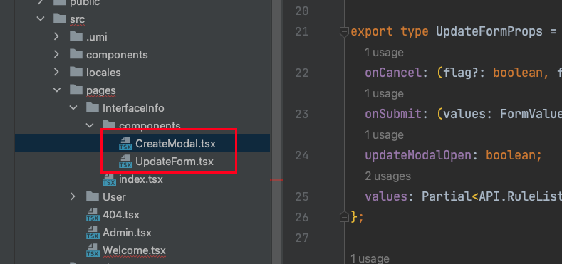

接下来修改从UpdateForm中粘贴的**CreateModal.tsx**的代码

```tsx
import { Modal } from 'antd';
import React from 'react';
import { ProColumns, ProTable } from '@ant-design/pro-components';
import '@umijs/max';

export type Props = {
  columns: ProColumns<API.InterfaceInfo>[];
  onCancel: () => void;
  onSubmit: (values: API.InterfaceInfo) => Promise<boolean>;
  open: boolean;
};

const CreateModal: React.FC<Props> = (props) => {
  const { columns, open, onCancel } = props;
  return (
    <Modal open={open} onCancel={() => onCancel?.()}>
      <ProTable columns={columns} />
    </Modal>
  );
};

export default CreateModal;
```

**这里我们复用了index中的columns**  这里我顺便把取消也写了

在**index.tsx**中使用

```tsx
  /**
   * @en-US Pop-up window of new window
   * @zh-CN 新建窗口的弹窗
   *  */
  const [createModalOpen, handleModalOpen] = useState<boolean>(false);
	
 	const columns: ProColumns<API.InterfaceInfo>[] = [
    {
      title: 'id',
      dataIndex: 'id',
      valueType: 'index',
    },
   // ...
  ]

	// ...
	<CreateModal
    columns={columns}
    onCancel={() => handleModalOpen(false)}
    onSubmit={() => {}}
    open={createModalOpen}
  />
```

测试一下

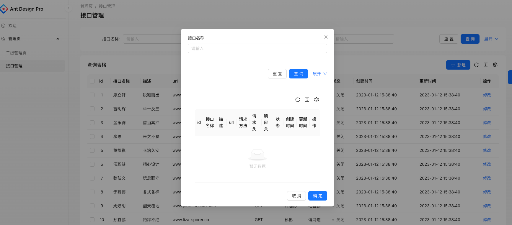

emmmm... 这是什么玩意??

查询官方文档可知，这是ProTable的默认type 所以我们需要给它指定一个form的type

```tsx
const CreateModal: React.FC<Props> = (props) => {
  const { columns, open, onCancel } = props;
  return (
    <Modal open={open} onCancel={() => onCancel?.()}>
      <ProTable columns={columns} type={'form'} />
    </Modal>
  );
};
```

再测试一下就正常啦~

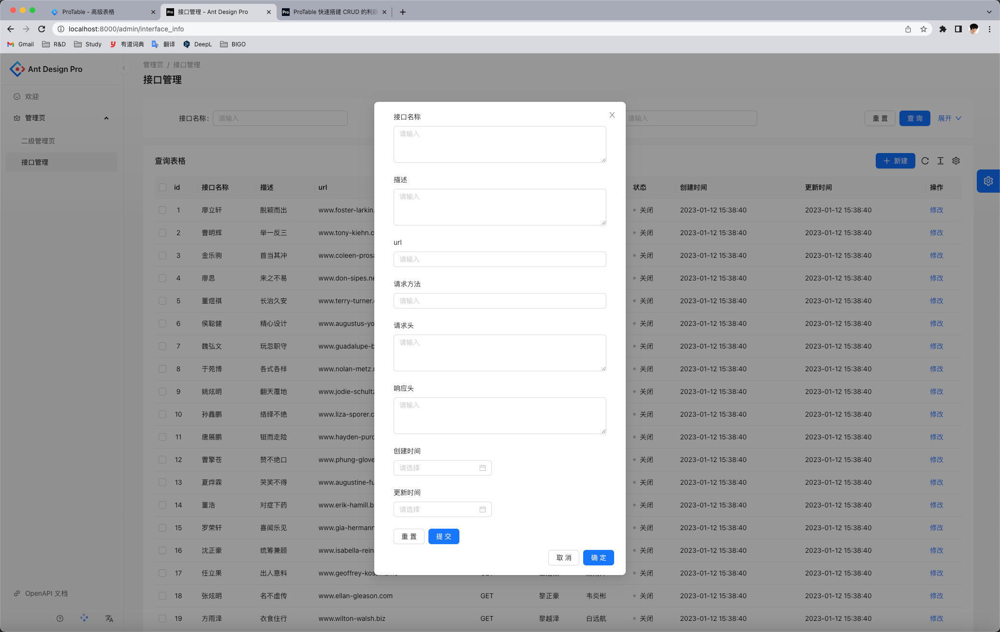

发现创建时间、更新时间我们并不需要。增加hideInForm属性

```tsx
    {
      title: '创建时间',
      dataIndex: 'createTime',
      valueType: 'dateTime',
      hideInForm: true,
    },
    {
      title: '更新时间',
      dataIndex: 'updateTime',
      valueType: 'dateTime',
      hideInForm: true,
    },
```


#### 2.2. 请求后端

**先简单处理一下请求报错的情况**

找到`src/requestConfig.ts` 修改一下响应拦截器

```typescript
  // 响应拦截器
  responseInterceptors: [
    (response) => {
      // 拦截响应数据，进行个性化处理
      const { data } = response as unknown as ResponseStructure;
      console.log('data', data);
      if (data.code !== 0) {
        throw new Error(data.message);
      }
      return response;
    },
  ],
```

再在`interfaceinfo/index.tsx中`新增请求后端的方法

```tsx
  const handleAddInterfaceInfo = async (fields: API.InterfaceInfoAddRequest) => {
    const hide = message.loading('正在添加');
    try {
      await addInterfaceInfoUsingPOST({ ...fields });
      hide();
      message.success('创建成功!');
      // 关闭Modal
      handleModalOpen(false);
      return true;
    } catch (error: any) {
      hide();
      console.log(error);
      message.error('创建失败!' + error.message);
      return false;
    }
  };

// ...

<CreateModal
  columns={columns}
  onCancel={() => handleModalOpen(false)}
  onSubmit={(values) => handleAddInterfaceInfo(values)}
  open={createModalOpen}
  />
```

再修改`CreateModal.tsx`

```tsx
const CreateModal: React.FC<Props> = (props) => {
  const { columns, open, onCancel, onSubmit } = props;
  return (
    <Modal title={'新建接口'} open={open} onCancel={() => onCancel?.()}>
      <ProTable columns={columns} type={'form'} onSubmit={async (value) => onSubmit?.(value)} />
    </Modal>
  );
};
```


测试添加成功

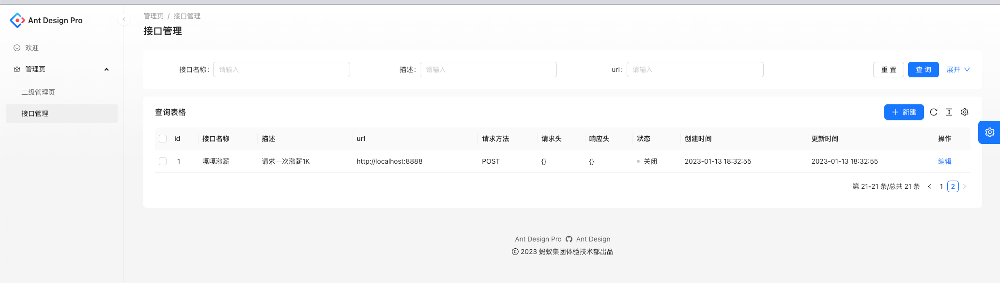


### 3、编辑接口信息

---

先把Modal的footer干掉   footer={null}

```ts
<Modal title={'更新接口'} footer={null} open={open} onCancel={() => onCancel?.()}>
		  // ...
  );
```


#### 3.1. 表单模块

新建文件`src/pages/InterfaceInfo/components/UpdateModal.tsx`

这里使用的useRef、formRef参考了[官方文档](https://procomponents.ant.design/components/table#%E9%80%9A%E8%BF%87-formref-%E6%9D%A5%E6%93%8D%E4%BD%9C%E6%9F%A5%E8%AF%A2%E8%A1%A8%E5%8D%95)

```tsx
import { Modal } from 'antd';
import React, {useEffect, useRef} from 'react';
import { ProColumns, ProFormInstance, ProTable } from '@ant-design/pro-components';
import '@umijs/max';

export type Props = {
  value: API.InterfaceInfo;
  columns: ProColumns<API.InterfaceInfoUpdateRequest>[];
  onCancel: () => void;
  onSubmit: (values: API.InterfaceInfoUpdateRequest) => Promise<void>;
  open: boolean;
};

const UpdateModal: React.FC<Props> = (props) => {
  const { value, columns, open, onCancel, onSubmit } = props;

  const formRef = useRef<ProFormInstance>();

  useEffect(() => {
    if (formRef) {
      formRef.current?.setFieldsValue(value);
    }
  }, [value]);

  return (
    <Modal title={'更新接口'} footer={null} open={open} onCancel={() => onCancel?.()}>
      <ProTable
        columns={columns}
        formRef={formRef}
        type={'form'}
        onSubmit={async (value) => onSubmit?.(value)}
        // 设置默认值
        form={{ initialValues: value }}
      />
    </Modal>
  );
};

export default UpdateModal;

```


#### 3.2. 请求后端

在`interfaceinfo/index.tsx`中新增请求后端的方法

```tsx
  /**
   * @en-US Update InterfaceInfo
   * @zh-CN 更新接口信息
   *
   * @param updateValue
   */
  const handleUpdateInterfaceInfo = async (updateValue: API.InterfaceInfoUpdateRequest) => {
    const hide = message.loading('正在更新');
    try {
      let res = await updateInterfaceInfoUsingPOST({ ...updateValue });
      if (res.data) {
        hide();
        handleUpdateModalOpen(false);
        message.success('更新成功!');
        return true;
      }
    } catch (error: any) {
      hide();
      message.error('更新失败!' + error.message);
      return false;
    }
  };      


// 这里的<UpdateModal/>代码是在原有的 <UpdateForm/> 基础上面改的
<UpdateModal
        value={currentRow || {}}
        columns={columns}
        open={updateModalOpen}
        onSubmit={async (value) => {
          const success = await handleUpdateInterfaceInfo(value);
          if (success) {
            handleUpdateModalOpen(false);
            setCurrentRow(undefined);
            if (actionRef.current) {
              actionRef.current.reload();
            }
          }
        }}
        onCancel={() => {
          handleUpdateModalOpen(false);
          if (!showDetail) {
            setCurrentRow(undefined);
          }
        }}
      />
```

出错了，猜测是Ant Design Pro的问题，猜错了，其实是columns中的id的type为index的原因。并没有id字段，所以我手动给一下

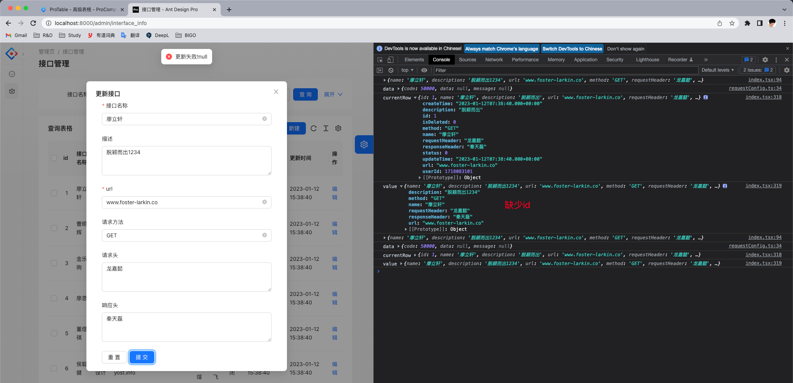

修改代码如下

```tsx
/**
   * @en-US Update InterfaceInfo
   * @zh-CN 更新接口信息
   *
   * @param fields
   */
  const handleUpdateInterfaceInfo = async (fields: API.InterfaceInfoUpdateRequest) => {
    const hide = message.loading('正在更新');
    try {
      if(!currentRow){
        return false;
      }
      let res = await updateInterfaceInfoUsingPOST({
        // 因为columns中的id valueType为index 不会传递 所以我们需要手动赋值id
        id: currentRow.id,
        ...fields,
      });
      if (res.data) {
        hide();
        handleUpdateModalOpen(false);
        message.success('更新成功!');
        // 刷新页面
        actionRef.current?.reload();
        return true;
      }
    } catch (error: any) {
      hide();
      message.error('更新失败!' + error.message);
      return false;
    }
  };

```

测试更新成功~


### 4、删除接口信息

---

**删除按钮**

```tsx
// 在columns中添加删除按钮	
{
      title: '操作',
      dataIndex: 'option',
      valueType: 'option',
      render: (_, record) => [
        <a
          key="config"
          onClick={() => {
            handleUpdateModalOpen(true);
            setCurrentRow(record);
          }}
        >
          编辑
        </a>,
        <a
          key="delete"
          onClick={() => {
            handleRemoveInterfaceInfo(record);
          }}
        >
          删除
        </a>,
      ],
    },
```

**调用方法**

```tsx
  const handleRemoveInterfaceInfo = async (record: API.InterfaceInfo) => {
    const hide = message.loading('正在删除');
    if (!record) return true;
    try {
      await deleteInterfaceInfoUsingPOST({
        id: record.id,
      });
      hide();
      message.success('删除成功!');
      // 刷新页面
      actionRef.current?.reload();
      return true;
    } catch (error: any) {
      hide();
      message.error('删除失败!' + error.message);
      return false;
    }
  };
```


测试删除成功~

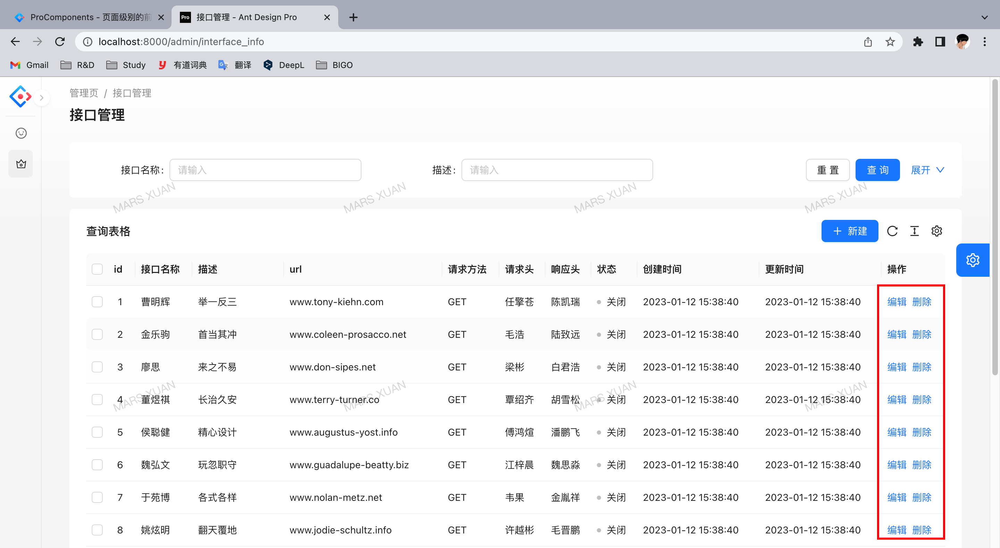

