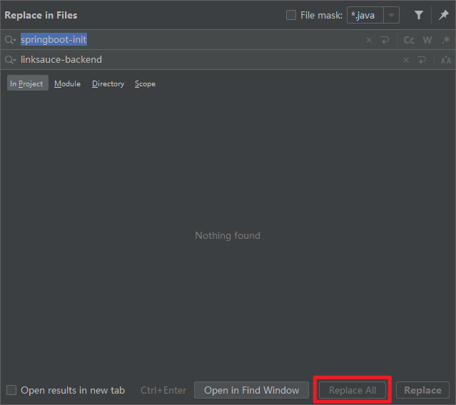
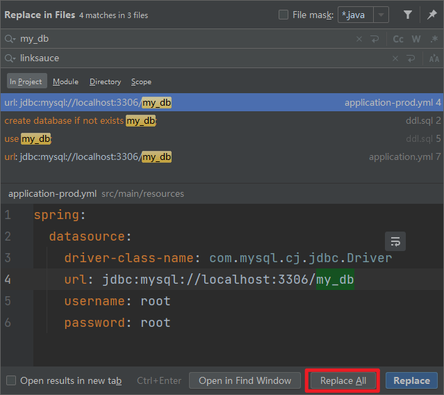
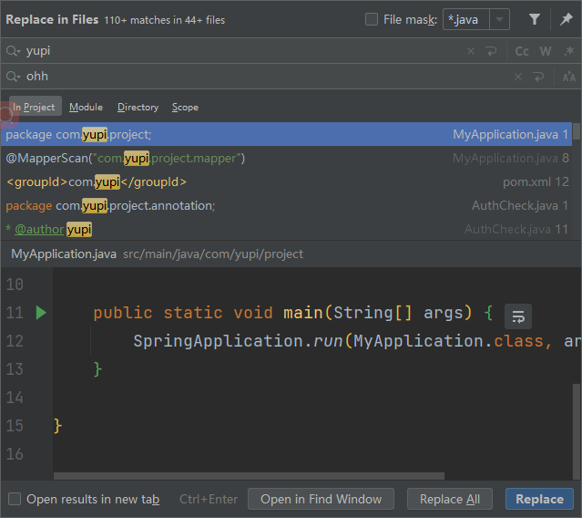
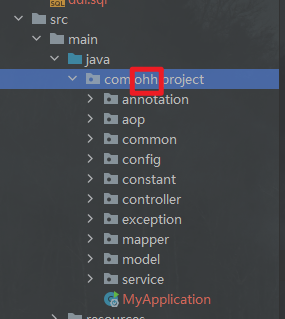
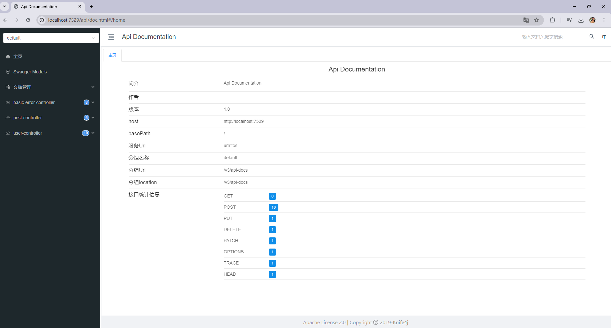

# LinkSauce API开放平台开发文档

## 一、项目脚手架搭建

### 1、Ant Design Pro

> 查看 [官方文档](pro.ant.design/zh-CN/docs/getting-started)

1. 安装初始化脚手架

   ```shell
   # 使用 npm
   npm i @ant-design/pro-cli -g
   ```

2. 打开将要存放项目的文件夹 创建项目

   ```shell
   pro create linksauce-frontend
   ```

   **选择umi版本**

   >   ```shell
   >   ? 🐂 使用 umi@4 还是 umi@3 ? (Use arrow keys)
   >   ❯ umi@4
   >    umi@3
   >   ```

3. 安装yarn

   ```shell
   # 全局安装
   npm install -g yarn
   ```

   查看yarn版本

   ```shell
   yarn -version
   ```

4. 安装依赖

   ```shell
   yarn
   ```

5. 运行测试`package.json`中的`start`

   

   

6. 项目瘦身

   - 运行`package.json`中的`i18n-remove`去除国际化，手动删除`src\locales`

     > 如果报错，检查一下是不是没删干净，可以手动去除

   - 删除`src\tests`

7. 重新安装依赖，重复第五步，确认是否能正常运行

   ```shell
   yarn
   ```


### 2、后端

> 使用springboot-init模板

1. 全局替换`ctrl+shift+r`



2. 修改pom文件中的描述文件

   ```xml
       <description>LinkSauce API开放平台</description>
   ```

3. 修改`application.yml`文件中mysql和redis的配置

4. 全局替换数据库名称

   

5. 全局替换包名 , 并手动修改包名称

   

   

6. 刷新maven

7. 运行并测试,利用swagger测试增删改查

   > 访问http://localhost:7529/api/doc.html#/home

   

